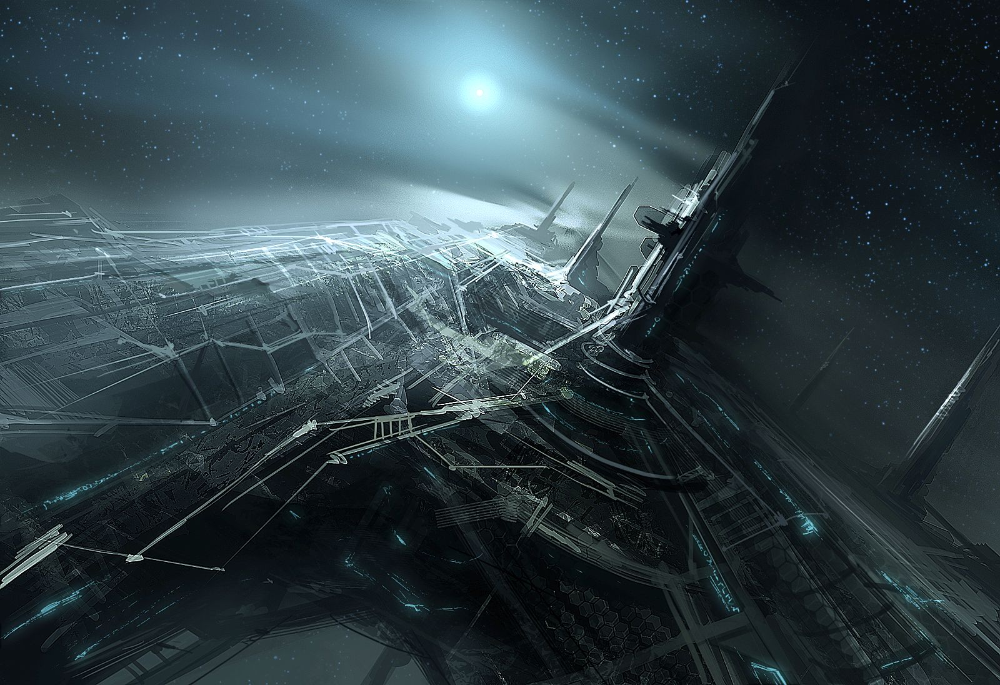

# 存在之云

## 基于Computronium的虚拟存在

### 虚拟环境中的生命

Ancients已经在基于Computronium阵列的虚拟环境中存在了10亿年。整个恒星、行星乃至最后整个星系的资源都被用于制造Computronium来扩展Ancients的“家园”。这种优雅而高效的生命形式的关键就是Computronium可以直接从一颗恒星中提取能量而无需经过任何转换过程。

### Computronium阵列

<figure><figcaption>
存在之云的一角（想象图）
</figcaption></figure>

Computronium部署于一个巨大的类似星云的结构当中，被称为“存在之云”。它围绕一颗恒星运行，像是这颗恒星的硬质外壳。在几个光分[^1]的距离上看，这个结构有些类似一个Ⅱ型文明建造的戴森球[^2]。但是它比戴森球庞大、复杂得多。其尺寸达到行星系统级别，在红外波段有微弱的辐射。靠近观察后便可以看到存在之云的优美结构。它和戴森球截然不同，完全不需要稳定期或者其他辅助系统来支撑这个庞大的结构。

存在之云所在的恒星寿终正寝之时，存在之云当然会被新星或者超新星爆发所摧毁。就算是小质量恒星不会产生爆发，在它生命周期的末端形成的白矮星也会因为没有能源而逐渐熄灭，存在之云也就没有了能量来源。但是不管恒星怎么结束自己的生命，在它周围的存在之云之中居住的Ancients却并不会被消灭。他们会将自己以及所有的知识数据迁移到另一个围绕着年轻恒星的存在之云当中去。

### 与现实宇宙的互动

过早虚拟化的文明——比如在Ⅰ型阶段就虚拟化的文明，常常陷入一种“自我满足”的状态。他们彻底逃避现实宇宙，不再与之交互，直到现实宇宙将承载他们的硬件毁灭，这些文明也随之灰飞烟灭。

很久之前Ancients就意识到了其中的陷阱，同时想办法避免这个陷阱。在Ancients虚拟化而成为超越现实的存在后，他们依然保持与现实宇宙完全交互的能力。Ancients一直在孜孜不倦地研究这个宇宙和它背后不为人知的秘密，同时Ancients也在考虑未来和他们规划的极其宏大的目标。

[^1]: 1光分（Light Minute）≈1800万km。1天文单位（AU）≈8.3光分。

[^2]: 戴森球（Dyson Sphere）是美籍英裔物理学家Freeman Dyson提出的一种包围整个恒星的巨大球壳结构，可以捕获全部或者大部分恒星辐射功率。Freeman Dyson认为这是文明演化到Ⅱ型路上对能量需求暴增的必然结果。
