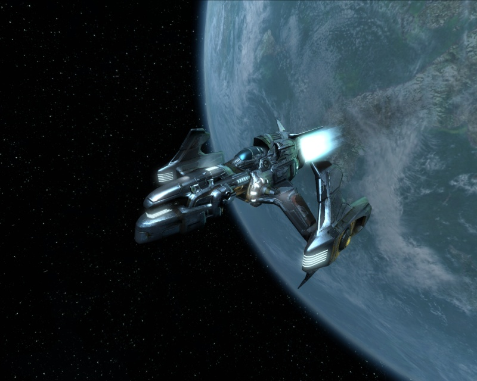
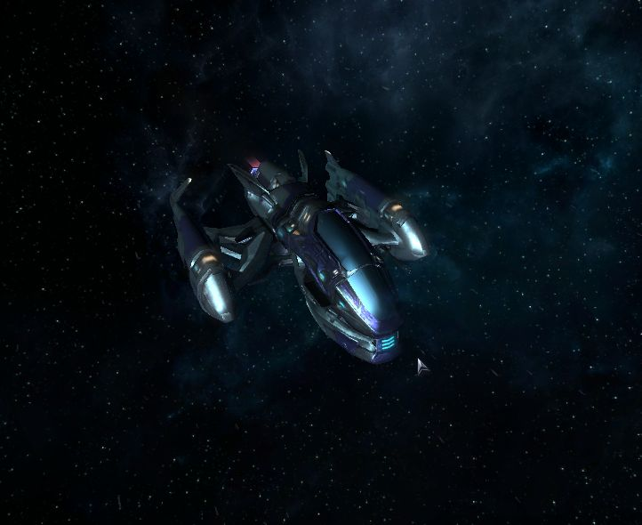
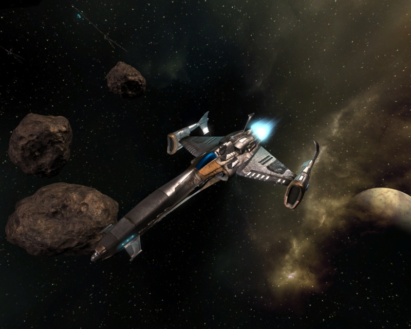
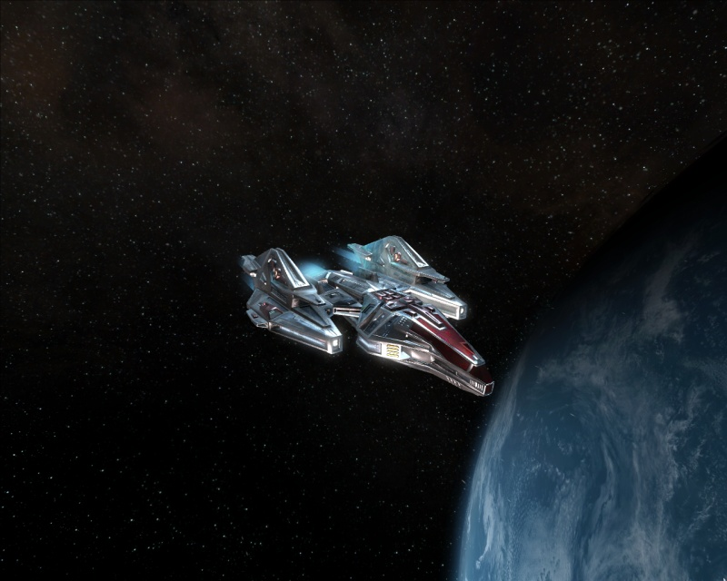
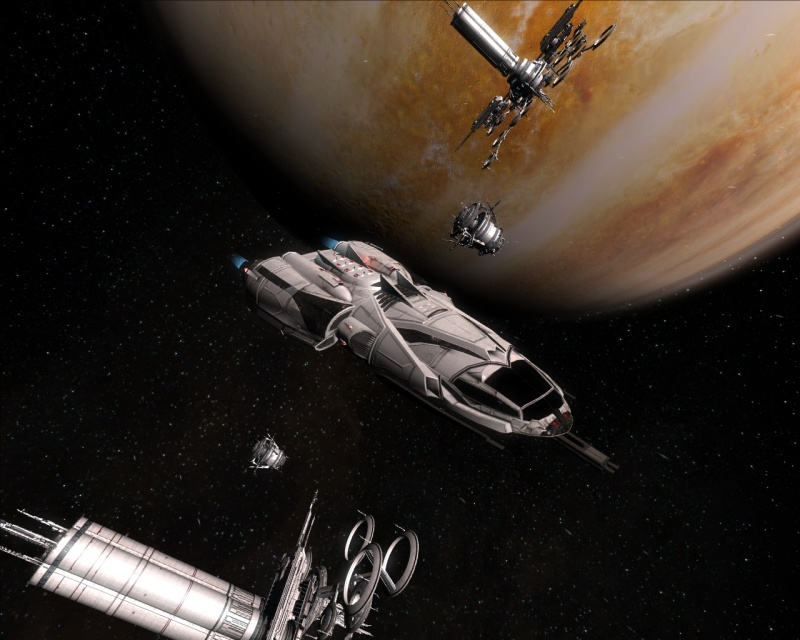

# 航天器类型

## 跳跃门关闭前的标准化分类

本节将以跳跃门关闭前Argon海军使用的标准舰船分类方式，它的依据是舰船的尺寸和用途，尽管这种分类方式未必100%准确，但是能够涵盖所有的已知飞船。

***

M5

M5侦察机：一种快速、灵活的飞船，带有脆弱的护盾和装甲防护。

主要型号[^1]：

* AP Discoverer
* AP Starburst
* BORON Octopus
* BORON Arrow
* PP Pegasus
* SPLIT Wolf
* SPLIT Jaguar
* TELADI Bat
* TELADI Harrier
* TELADI Kestrel
* USC Rapier
* ATF Valkyrie
* Xenon N
* Kha'ak Scout
* Yaki Fujin

M4

M4轻型战斗机：一种快速飞船，火力中等。

主要型号：

* AP Buster
* BORON Pinanha
* BORON Mako
* PP Poseidon
* PP Pericles
* SPLIT Scorpion
* TELADI Hawk
* TELADI Buzzard
* USC Sabre
* ATF Mijollnir
* Xenon M
* OTAS Eurus
* Kha'ak Interceptor

M4+

M4+是M4战斗机的强化版本。

主要型号：

* AP Elite
* BORON Pike
* TELADI Kite
* PP Theseus
* SPLIT Asp
* OTAS Solano

M3

重型战斗机，速度较之M4、M5更慢，但是换来了更大的火力和更高的防护等级。

主要型号：

* AP Nova
* BORON Eel
* BORON Barracuda
* PP Prometheus
* PP Perseus
* SPLIT Mamba
* TELADI Falcon
* USC Scimitar
* ATF Thor
* Xenon L
* OTAS Venti
* Kha'ak Fighter

M3+

火力与防护较之普通M3重型战斗机更胜一筹的机种。

主要型号：

* AP Eclipse
* BORON Mobula
* BORON Skate
* PP Medusa
* SPLIT Chimera
* Teladi Kea
* USC Machete
* USC&#x20;
* ATF Fenrir
* Xenon LX

[^1]: 本部分中的飞船闵晨
