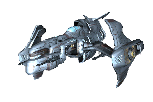

# 航天器类型

## 跳跃门关闭前的标准化分类

本节将以跳跃门关闭前Argon海军使用的标准舰船分类方式，它的依据是舰船的尺寸和用途，尽管这种分类方式未必100%准确，但是能够涵盖所有的已知飞船。

***

M5

M5侦察机：一种快速、灵活的飞船，带有脆弱的护盾和装甲防护。

主要型号[^1]：

* AP Discoverer
* BORON Octopus
* PP Pegasus
* SPLIT Wolf
* SPLIT Jaguar
* TELADI Bat
* TELADI Harrier
* TELADI Kestrel
* USC Rapier
* ATF Valkyrie
* Xenon N

[^1]: 本部分中的飞船名称与X3中相去甚大，但是译者无法确定是否是X2及其之前的名称，所以原样保留的基础上增补了X3中的名称，另外ATF的飞船没有收录，本节特作补充。
