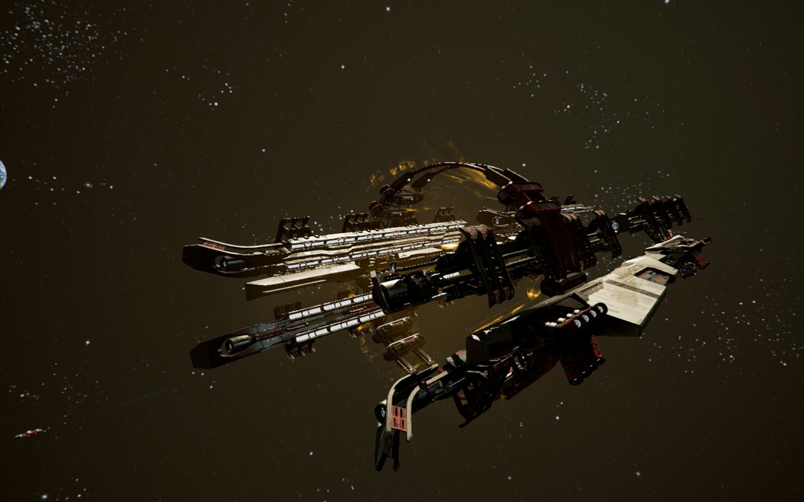

# 轨道加速器

## 直接飞行

直接进行行星际飞行是非常不经济的，效费比太低。在轨道上进行直接飞行的飞船必须在自身的加速和对抗行星引力上消耗大量的燃料。

## 入轨飞行

直接飞行的替代方案之一就是入轨飞行，或者叫“霍曼变轨[^1]”。在这种方法中，飞船在某个很精确的时间发射，沿着逐渐展开的轨道环绕某颗行星飞行，直到在特定时间进入目标轨道。这种飞行方法很省燃料，但是非常慢。

## 拉格朗日飞行

轨道上的每个天体周围都有一些特殊的点，称为拉格朗日点或者L点。在这些点上，各个天体的重力互相抵消，万有引力非常微小。因此，船坞、空间站等设施比较适合放在此处。

然而，拉格朗日点的一个附加优势被长期忽略。那就是拉格朗日点一直在不断地运动。飞船可以从一个点“荡”到另一个点，足以跨越整个行星系统而几乎不用消耗燃料。

虽然拉格朗日飞行效率极高，但是速度依然很慢，只有一些大宗货运和无人研究任务会使用。对于常规客运或者货运而言，这种方法太慢了。

## 轨道加速器

<figure><figcaption></figcaption></figure>

为了让拉格朗日飞行变得更加实用，就要让飞船在拉格朗日点之间飞行前具备足够高的初速度。轨道加速器（TOA）[^2]的设计目的就在于此。此外，它还可以保证最初飞行方向最大程度的稳定。

在CoP解体前，JSDD已经在多个Argon星系中开始建造最初的TOA加速器，包括Sonra行星系统。这一技术的许可已经出售给了Teladi公司、Paranid神圣帝国和Boron王国。

[^1]: 霍曼变轨是德国物理学家Walter Hohmann在1925年提出的一种变轨方法，简单描述，就是在低轨道上加速，进入椭圆转移轨道，在椭圆轨道的远地点再次加速，进入高轨道。也可以反过来从高轨道进入低轨道。1997年，将霍曼变轨应用于太阳系内一系列行星间的飞行方式对外发布，被称为“行星际交通网”。

[^2]: X Encyclopedia原文为“Orbital Linear Transaccelerator”，而X3 TC、AP中的名称为“Trans-Orbital Accelerator”，此处以游戏中的名称为准。
