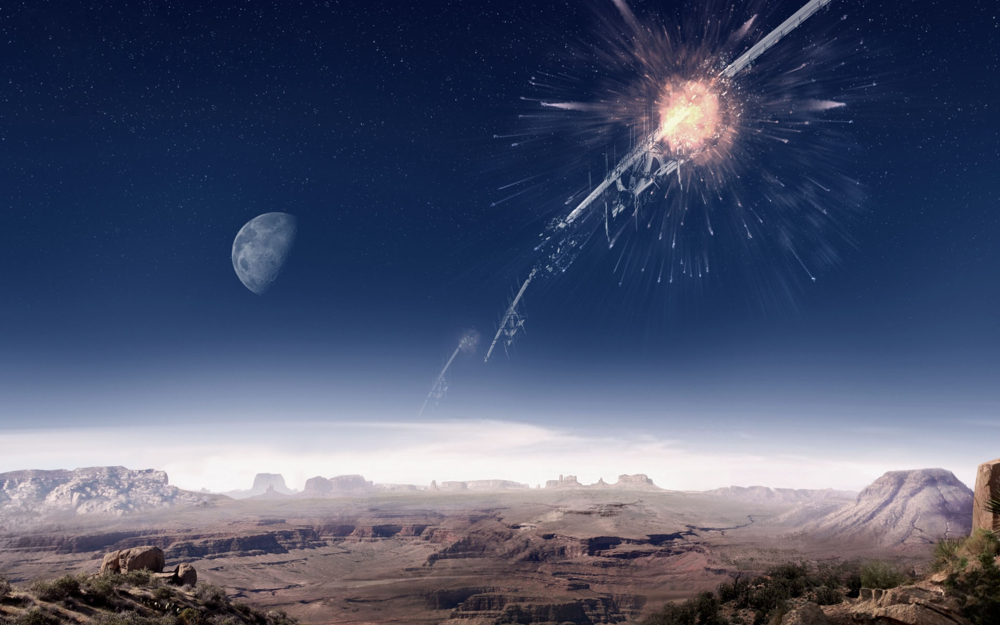

# 地球人冲突

## 兄弟不和

几乎与此同时，Argon卷入了另一场战争——Kha'ak冲突。这场战争从NT 761年开始，一直持续到NT 765年。Argon在USC的帮助下赢得了关键的Heretic's End战役，避免了一场灭顶之灾。Argon对新盟友的出现表现出了欢迎，并邀请地球加入CoP。GEOSS却断然拒绝了这一邀请，他们跟希望与Argon联邦单独建立一种松散的合作关系，不去接触CoP的其他国家。GEOSS已经意识到，地球人数百年间将自己封闭在太阳系内独立发展，他们的技术和实力已经远远超越了CoP。

### 地球人的秘密行动

GEOSS不仅拒绝加入CoP，还试图干涉Argon联邦。

NT 772年，一个秘密情报网悄然形成。几年后，这个情报网被曝光，GEOSS与Argon联邦之间的关系迅速降温。

## 从冷战到热战

NT 774年，GEOSS与Argon联邦之间的关系进一步恶化。GEOSS通过了《AGI[^1]控制法案》，授权USC舰队开赴Argon边境，检查一切Argon飞船上是否装有AGI程序。地球人与Argon之间的冲突已经不可避免。

### Argon的先手

Argon联邦海军完全无法和强大的USC正面对抗。于是Argon寻求了Beryll的支持，将后者手中的改造者技术用在了自己的舰队上。Argon联邦海军建立了自己的TF/CPU和装配无人机，也建立了自己的跳跃门来维持补给线。

作为突袭的准备工作，Saya Kho和Sherman Hiatu在太阳系中卧底，Split的Neham t'Gllk负责全局协调。

## 第二次改造者战争

第二次改造者战争在CE 2946年爆发。一支改造者舰队的无人机在Beryll的控制下来到了太阳系，并且对内太阳系的金星、火星和地球展开了全面攻击。当时USC主力舰队都在其他星区，召回舰队的动作不够迅速，导致地球毫无防备。

<figure><figcaption>
Torus Æternal被摧毁（图像来自数据仓库）
</figcaption></figure>

CE2984年2月5日，地球的最后一道防线Torus Æternal被摧毁，大批改造者无人机飞临地球上空。但是在**Jei Nirin**博士、**Tebathimanckatt**将军和**Elena Kho**少校[^2]（后晋升为上校）的合作努力下，改造者舰队最终被摧毁。Elena Kho宁可牺牲生命也要拯救她的家园。

[^1]: AGI，Artificial General Intelligence，人工通用智能。详情参考：[改造者与Xenon/相关概念](../gai-zao-zhe-yu-xenon/xiang-guan-gai-nian.md)、[科学与技术/AI与AGI](../ke-xue-yu-ji-shu/ai-yu-agi.md)。

[^2]: 原文中Elena Kho的军衔为“上尉”，但是Elena在驾驶Getsu Fune出发寻找Kyle Brennan时已经是少校军衔，没有任何资料表明Elena在太阳系军衔降级。另外，从上尉直接擢升到上校有些违反常识，因此译者认为此处是“少校”更加合理。
