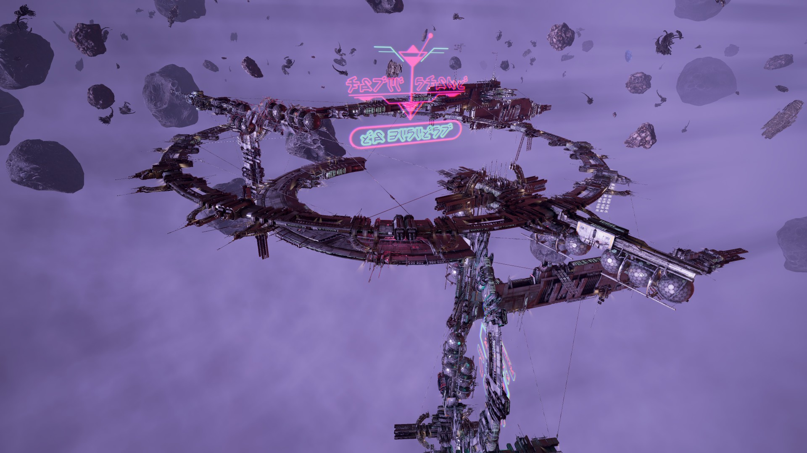

# 跳跃门网络的恢复

大谷廉和Yisha Tarren观测到位于瞭望台α的跳跃门突然激活，通过这个跳跃门后，他们来到了DeVries星区，并和当地的Cantera共和国取得了联系。

NT 803年，在Sacred Relic星区，约言联盟观测到该星区的跳跃门突然激活，并且连接到了一个未知星区，这个未知星区后来被命名为“Pious Mists”。NT 820年，大量的跳跃门开始重新上线，并且足够稳定，可以让飞船通过其中。部分跳跃门指向的目的地没有变，但是也有很多跳跃门指向了和之前完全不同的目的地。新的跳跃门网络成型了。

## 新的政治格局

在跳跃门网络土崩瓦解的黑暗时代，一个个孤立的星区得不到原先中央政府的管理，为了求生存，一些新的政权开始出现，并构成了新跳跃门网络的政治版图的一部分。

### Antigone共和国

在跳跃门断开后，位于Antigone Memorial星区的Argon居民与周围区域的居民联合成立了Antigone共和国，以期在没有Argon联邦支援的情况下生存下来，特别是对抗Xenon的威胁。

在跳跃门恢复后，Antigone共和国与Argon联邦立即取得了联系，并且建立了非常牢固的盟友关系，包括一系列非常紧密的技术合作，如双方联合开发的大型舰船，Antigone共和国的Sandwell行星上也保存着Argon联邦最大的一个数据库设施，双方也联合开展了针对Xenon的军事行动，经贸往来也极为频繁。但是Antigone共和国对回归Argon联邦持谨慎态度。

### Hatikvah自由联盟的变化

在创立之初，Hatikvah自由联盟的理念是反战、和平、自由、自由贸易。由于他们对贸易非常宽松的管理，Hatikvah很快便吸引了犯罪团体的注意。跳跃门关闭后，在令人绝望的处境下，Hatikvah自由联盟的行事风格更加像一个海盗团体，他们与鳞片公约组织开始了一系列合作。

跳跃门重新开启后，Hatikvah自由联盟与Argon联邦取得了联系。最近，Hatikvah自由联盟表现出重新与Argon联邦紧密结盟的愿望，他们的重点开始转向合法的贸易，以试图修复与Argon联邦的关系。

### Split内战

跳跃门断开之前，Split联合酋长国的统治氏族——Rhonkar氏族就已经陷入了内乱和背叛之中。随着跳跃门断开，Rhonkar大酋长失去了对大多数氏族的直接控制。部分较小的氏族不满于Split社会一直以来的残酷的奴隶制度，以及这种强者通吃的社会哲学下大氏族对自己的剥削而寻求改革，这些小型氏族联合组成了自由氏族联盟。

但是，以Zyarth氏族为首的大氏族所代表的保守势力依然坚持Split应当保留原有的社会制度，因此与自由氏族联盟爆发了内战。Zyarth氏族在跳跃门断开前就服务于Rhonkar大酋长，他们的星区毗邻Xenon星区，因此Zyarth氏族的经济模式自给程度非常高，跳跃门断开后，这种经济结构给了Zyarth氏族非常大的优势。随着很多历史悠久的氏族一个个消亡，幸存下来的Zyarth氏族成了唯一的幸存者。他们利用了这个机会，推翻了Rhonkar氏族的统治，甚至期望最终能够统一整个Split。

<figure><figcaption>
位于抑制者旗舰Ravenous Wight上的抑制者王庭（摄于NT 825年）
</figcaption></figure>

Split内战期间，自由氏族联盟的女性“抑制者[^1]”们认为，自由氏族联盟在对Zyarth氏族的战事中失利的主要原因是男性氏族酋长们的冲动天性。她们决定遵照Ghus t'Gllt设立这一制度的古老初衷，准备自己夺取权力。她们不仅要纠正酋长们的天性，更要纠正整个Split种族的社会风气。抑制者们联合起来组建了抑制者王庭，攻击了Zyarth的审判庭要塞，意图将整个Split种族都纳入自己的麾下。但是抑制者王庭宣布独立时，她们遭到了一起重大的破坏行动的攻击，事件中抑制者们暴露出的弱点导致了众多原本准备倒向抑制者的摇摆势力倒戈，这对抑制者王庭的分裂活动造成了巨大的打击。

在Split对外战争和内战当中失利的小团体和个人组成了堕落氏族联盟，其中也包括失败的Split、重获自由的奴隶、雇佣兵、冒险家和各路罪犯。堕落氏族联盟充分利用了他们手中的武力，靠劫掠挺过了跳跃门断开的时期。堕落氏族联盟与Zyarth氏族、自由氏族联盟都没有瓜葛，他们以“堕落者”的称号而自豪，并期望通过各种“英雄事迹”扬名立万，甚至建立属于自己的政权。

### Paranid内战

由于Paranid Prime并未连入新的跳跃门网络，Paranid神圣帝国的教皇也因此下落不明。缺乏统一指挥的Paranid很快分裂成了两个不同的宗教派别——Paranid神界与教皇圣教团。双方都以“Paranid信仰正统”自居。

Paranid神界是一个信奉神圣三维的神权封建社会，他们利用Paranid古老的圣言巩固自身的传统权力结构和统治权威。虽然Paranid神界没能和Paranid Prime的教廷取得联系，但是他们仍然自视为Paranid信仰的真正传承者。跳跃门重构后，Paranid对传统的古板信仰使得他们与教皇圣教团之间的关系日益紧张，最终导致了Paranid内战。对于Paranid神界而言，消灭教皇圣教团并不是最终目的，他们想要的是让教皇圣教团“迷途知返”。

教皇圣教团同样是一个自视为“Paranid宗教正统”的、由一群宗教事务管理者组成的政权。教皇圣教团对Paranid传统教义进行了激进的全新阐释，这导致了他们与Paranid神界之间产生了巨大的矛盾。同Paranid神界一样，教皇圣教团的目的并不是打倒Paranid神界，而是希望对方皈依自己的信仰。

隐居的Paranid军阀克罗曼茨拉特在某个势力的暗中协助下开始崛起，他建立了“三位一体圣国”，并尝试调停Paranid神界和教皇圣教团之间的矛盾，随着双教皇的问题得到了解决，Paranid实现了统一。作为新成立的政权，三位一体圣国的施政方针尚不明确，但是所有人都期望他们能够推动跳跃门网络中的各个政权向和平共处的方向发展[^2]。

### 公爵海盗团的衰落

在成立之初，公爵海盗团表面上是一个Paranid神圣帝国官方认可的非政府安保机构。但是在背地里，它很快开始腐化堕落。它决定破坏Paranid帝国政府的权威。公爵海盗团占领了若干星区，并将其变成了走私、海盗、异见分子的乐园。在地球人冲突期间，公爵海盗团的猖獗活动严重分散了Pontifex教皇的精力。公爵海盗团的总部位于边境星区Lasting Vengeance，可能是为了纪念公爵海盗团的一位领导者。

公爵海盗团有一个臭名昭著的要求：他们要求所有成员宣誓切断与原有组织的所有联系，并让海盗团成员执行各种危险的渗透和暗杀任务，来检验他们的忠诚度。公爵海盗团的行事风格不可能让他们在主要政权那里保持良好的信誉，很快，Paranid官方开始追捕公爵海盗团，他们的总部遭到了袭击，但是海盗首领却屡屡从追杀中死里逃生。

在NT 780到NT 782年间，根据一些稀少的记录，公爵海盗团几乎要完成他们历史上最宏大的计划，但是Lasting Vengeance的跳跃门关闭了。跳跃门关闭后，公爵海盗团迅速土崩瓦解。在新的跳跃门网络中，起初人们认为公爵海盗团已经消失，但是在Paranid疆域内，还是偶尔有目击报告。但是在Paranid内战这一更为严峻的背景下，这些报告并未得到太多关注。

### Teladi公司的境况

Teladi公司财政部曾经的目的是支持Teladi的商业扩张和制裁内部的腐败行为，但是随着跳跃门网络的重构，Teladi边境的Xenon活动开始加剧，财政部将大多数精力都放在了防御Xenon活动上。暂时不和Xenon作战的财政部人员则在Teladi公司的疆域内进行治安巡逻。对于Teladi公司的大多数人来说，鳞片公约组织是一个可以容忍的小麻烦，甚至对公司内一小撮道德败坏的腐败分子来说，他们是值得合作的商业伙伴，但是财政部不会对鳞片公约组织的不法行为有任何容忍。

鳞片公约组织是由贪婪的不法商人、亡命杀手组成的集团，随着Scale Plate Green星区被Xenon入侵，大批流离失所的难民也加入其中。最初，鳞片公约组织只在Scale Plate Green附近星区活动，随后，他们开始和一些Teladi公司员工的非法活动提供支持。在跳跃门关闭期间的经济衰退中，他们没了生计，跳跃门重启后，破产的Teladi很快便将鳞片公约组织的影响力扩大到了整个网络。鳞片公约组织起初的活动范围主要是倒卖一些非法物品，但是很快他们就开始雇凶杀人、劫持船只和人质。

据传言，部分鳞片公约组织的匪徒曾经还是在财政部受训的战士，但是他们在心理测试中被淘汰。

### 太阳系的重组

随着Torus Æternal被Saya Kho炸毁，太阳系的民众对GEOSS的军事组织USC和ATF护卫太阳系的能力产生了质疑。CE 2952年，在民众压力下，USC与ATF解散，就地重组为一个新的军事组织——Terran保护国。

Terran保护国对内太阳系的核心区域（包括水星、金星、地球和火星）采取了非常严格的管控，就算是太阳系公民也无法轻易接近地球。同时Terran保护国对前CoP各成员未能处理好Xenon的问题表示失望，于是Terran保护国采取主动措施，派出远征部队在跳跃门网络中四处搜寻Xenon的踪迹并予以歼灭，这种行动无疑严重侵犯了其他政权的主权，Terran保护国还毫不掩饰地干涉其他政权的内政，试图改变他们对AGI技术的态度，这种做法导致了很多前CoP政权与他们的摩擦。

跳跃门关闭后，很多太阳系外的居民被滞留在太阳系。GEOSS担心这些难民会成为太阳系日后的不稳定因素。为了让他们远离内太阳系，GEOSS将他们组织起来，以探索、殖民太阳系外围区域为名义让他们进行深空探索。跳跃门网络恢复后，海王星的一个跳跃门突然连接到了多个无人星区，GEOSS随即鼓励他们去探索、殖民这些星区，他们终于拥有了自己的立足之地，并以第一个被发现的Segaris星区为名，自称为“Segaris先驱者”。

Segaris先驱者与GEOSS的关系仍然非常微妙，他们在很谨慎地追求独立。Segaris先驱者仍然高度依赖GEOSS的保护和经济支持，他们认为最好的谋求独立的方法就是发展先进的科技，这是他们未来争取真正独立的筹码。

### Yaki的命运

跳跃门关闭后，Yaki陷入了非常被动的境地，物资短缺成为了Yaki的致命问题，而Xenon对Salvage Spur的突然占领更是让Yaki几乎丧失了最后的立锥之地。

由于Yaki曾经通过Beryll帮助Marteen Winters，他们在一定程度上掌握了比较多的Xenon技术，他们利用手中的Xenon技术改装劫持来的飞船（主要是Paranid飞船），让这些飞船更符合自己的需求，他们甚至利用Xenon技术进行了侵入式的人体改造，并通过这种手段在一定程度上控制了Xenon。

Yaki在Salvage Spur拥有一个信号放大站，该放大站可以向整个跳跃门网络中的Xenon发出指令——包括太阳系，这也使得Terran保护国对Yaki产生了关注。

### 活力辛迪加

<figure><figcaption>
活力辛迪加运营的赌场“Aurora”
</figcaption></figure>

在Windfall接入Avarice之前，活力辛迪加（Vigor Syndicate）是由多个小型犯罪组织组成的松散联盟。他们通过经营大型赌场、举办高风险的游戏、提供安保服务以及非法物品的交易来获利。跳跃门关闭期间混乱的治安状况也为他们的活动提供了温床。为了保持对财富占有，这些组织逐渐结盟，形成了现在的活力辛迪加。

活力辛迪加不是唯一一个在跳跃门关闭期间兴起的有一定组织性的犯罪集团，但是他们是唯一一个延续至今的。当Windfall与Avarice星区连同后，活力辛迪加很快便开始利用该星区内的分潮清道夫，向他们提供高利贷，并且通过工业制造链使Avarice星区内的分潮清道夫政权依附于自己。

虽然活力辛迪加没有明确的领导阶层，各种背叛事件也时有发生，但是该组织已经发展到了相当的规模，并且具备了一定的稳定性，有效地展示了对外的统一意志。随着Argon和Teladi的星区也接入到了Windfall，活力辛迪加在外部力量的压力下更好地实现了整合，以便防止外来势力对Windfall的渗透。他们游离于法律之外，为各种违法组织提供合适的成长空间，当然，活力辛迪加也会通过对这些组织提供庇护而获利。

### 分潮清道夫

<figure><figcaption>
Avarice星区的重要地标“破潮砥柱”大部分结构深入小行星内部以抵御不稳定恒星爆发的“星潮”
</figcaption></figure>

分潮清道夫（Riptide Rakers）是一个由矿工、交易员和拾荒者组成的松散团体。从某种程度上说，他们是一群努力求生的苦命人，因为他们所处的Avarice星区环境极为恶劣。分潮清道夫组织混乱、没有任何官方军事力量，他们不会对跳跃门网络的其他政权和居民构成威胁，他们也不想这么做，他们拼尽全力只是为了生存下去。

在生存的压力下，分潮清道夫不得不动用所有的智慧，他们专门从事报废船只的打捞和Avarice周围星区的太空垃圾的回收工作。由于Avarice星区恶劣的环境和时不时爆发的“星潮”，他们总能在附近找到足够多的废船和垃圾。随着跳跃门重启，他们已经开始拆除更大尺寸的飞船残骸，废品交易的规模也开始扩大。

分潮清道夫也相当固执，尽管星潮不时冲击着整个Avarice星区，将这个星区的环境变得异常危险，他们却仍然坚守在这个艰苦而危险的环境中，近年来，他们找到了一种凝聚态物质——戍子，可以让空间站有效抵御星潮的冲击，最初将这种物质商业化的Northriver公司在活力辛迪加的庇护下大发垄断财。但是星潮爆发时，没能及时到达安全地点的飞船和缺少戍子保护的空间站仍然会遭到严重的破坏。幸运的是，某个不明势力开始在Avarice星区以低价出售戍子，这打破了Northriver的垄断，并导致其股价暴跌。

跳跃门网络中的部分居民无法理解为什么分潮清道夫会将自己置于如此危险的境地之中，但是如果去问分潮清道夫自己的话，他们的答案很简单：他们对Avarice星区的危险已经麻木了，并且这就是他们的生活方式，而他们没有别的地方可以去。

### 寻回Boron王国

NT 812年，漂泊州成立。漂泊州由一群与王国失去联系的Boron组成。虽然他们与Kingdom End失去了所有联系，但是他们仍然不愿意组建自治政府，不过为了生存，它们还是需要组织起来。

漂泊州的最高行政长官是皇家事务长。皇家事务长的首要任务是保证漂泊州的人民安居乐业，并在联系到女王陛下之前尽量维持下辖星区的稳定。皇家事务长由选举产生，负责监督资源分配、组织防务与外交事务。

在漂泊州与Boron王国重新取得联系后，漂泊州立即回归王国统治。

NT 825年前后，约言联盟接到了来自Boron首都Kingdom End的通讯，Kingdom End的Boron科学家正在尝试激活本星区的跳跃门，但是始终没有进展。

此后不久，约言联盟发现位于Heretic's End的跳跃门有异常的活动，于是组织了一支庞大的科考队，聚集于Heretic's End。跳跃门激活后，科考队发现对面是一个贫瘠的星区，但是在其中发现了Boron飞船的残骸。

经过进一步的探索，科考队与本地的Boron——即漂泊州取得了联系。

<figure><figcaption>
ALI科学家打通前往Kingdom End星区的跳跃门
</figcaption></figure>

在某未知势力和Boron科学家Boso Ta的协助下，科考队得以成功激活Sanctuary of Darkness中的跳跃门，来到了Boron王国，并见到了此时统治Boron王国的统治者Polypheides女王陛下。

重新接入跳跃门网络的Boron王国得以缓解原漂泊州治下星区长期以来的物资短缺的困境，但是Boron王国也立即面临严峻的挑战：一方面是在Sanctuary of Darkness星区中极为猖獗的Kha'ak活动；另一方面则是老对手Split的袭扰。

[^1]: “抑制者”是Split历史上著名的大酋长Ghus t'Gllt设立的社会制度。详情参见[Split种族介绍](../zhong-zu-jie-shao/split.md)。

[^2]: 三位一体圣国能否成立取决于玩家在“撬动世界的杠杆”中的任务选择。但是根据官方Wiki，“正统”结局应该是三位一体圣国统一了整个Paranid。
