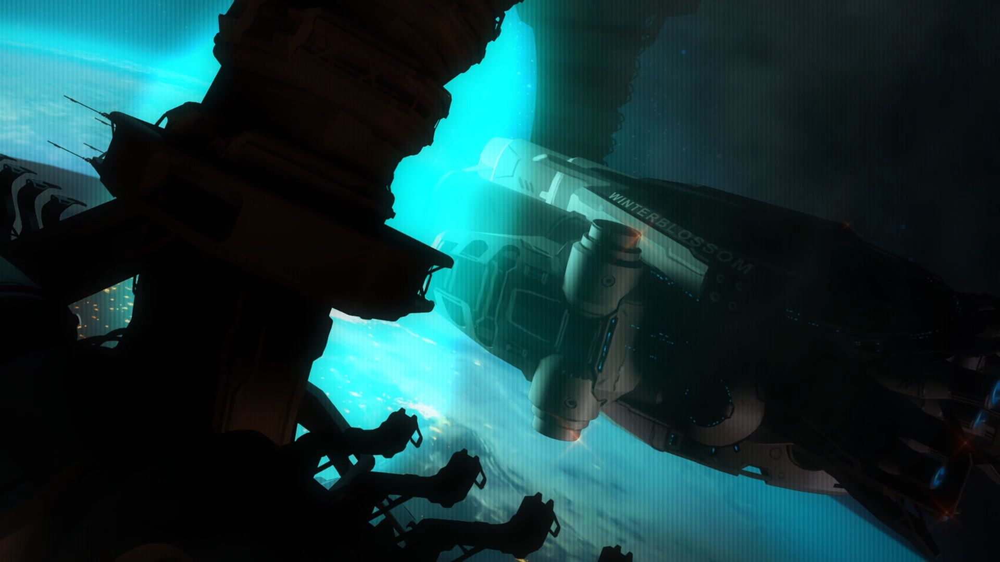

# Winterblossom计划

## 万千星球，万千世界

### USC的成立

所有跳跃门项目的成员一致同意：对这个未知跳跃门网络的探索可能会获得颠覆性的成果，其中的一种可能性便是与外星智慧生命的第一次接触[^1]。而第一次接触的危险性是未知的。CE 2043年，USC（United Space Commando，联合太空司令部）成立。USC的宗旨是保护地球不受敌对外星生命的入侵。

### USCSS Winterblossom

USC成立的同时，USC Winterblossom（冬日花）也开工建造。这是人类历史上第一艘真正意义上的星际飞船。她身负探索、研究跳跃门网络的和平任务离开地球。Winterblossom升空时，全球都为之狂喜，这是当时星空热潮中最为浓墨重彩的一笔，相关的准备工作在全球人民的高度关注下进行着。

[^1]: 第一次接触（First Contact）是两种互不知晓的文明的第一次接触。如1492年西班牙人与阿拉瓦人的第一次接触。随着人类文明的全球化进程，现在的“第一次接触”更多地指的是人类与外星文明之间的首次接触。
