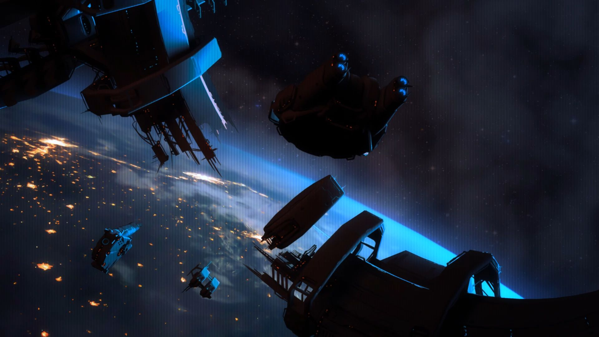

# 星空之路

## 先锋时代

20世纪的冷战见证了人类离开自己的摇篮、走向星空的旅程。起初，太空探索很大程度上带有冒险的色彩。但是随着时间的推移，人类的自信心也随之增长。

1969年，尼尔·阿姆斯特朗[^1]和埃德温·“巴兹”·奥尔德林[^2]率先在地球以外的星球上留下了自己的足迹。当他们站在月球表面的时候，他们上空被称为“哥伦比亚”的指令舱里，迈克尔·柯林斯[^3]正在安全的距离观察着他的同事们。

<figure><figcaption>
阿姆斯特朗在月球表面留下的第一个脚印（图像来自NASA）
</figcaption></figure>

1982年，人类开始定期发射航天飞机，航天飞行成为一种常态化的活动。然而，人类在两次灾难性的事故中损失了两架航天飞机。分别是1986年的挑战者号[^4]和2003年的哥伦比亚号[^5]。这两次事故也是对航天飞行的危险性的尖锐提醒。

<figure><figcaption>
挑战者号航天飞机事故（图像来自NASA）
</figcaption></figure>

国际空间站——有史以来最复杂、最昂贵的人造工程、人类太空探索皇冠上的明珠——在2020年前就被除役，甚至没有到她的设计寿命[^6]。

<figure><figcaption>
国际空间站（图像来自NASA）
</figcaption></figure>

## 全球经济危机的结束

在影响深远的全球经济危机[^7]期间，航天活动的巨大耗资与人们的现实需求产生了巨大的矛盾。雪上加霜的是，已经超期服役的航天飞机终于结束了最后一次飞行[^8]，而人类还没有足够经济的航天器[^9]可以取代它。第一次星空探索的热潮走向了尾声。尽管有诸如火星探路者号[^10]、勇气号[^11]、机遇号[^12]这样成功的火星探测行动以及其他一些探测器的发射，这些成功没能掩盖人类航天事业的整体衰退[^13]。

<figure><figcaption>
STS-135任务，亚特兰蒂斯号航天飞机最后一次发射升空（图像来自NASA）
</figcaption></figure>

### 日本的悄然崛起

日本是最初几个从经济危机中复苏的国家之一。与美国、欧盟与中国不同的是，它选择了不惜一切代价保护本国基础科学研究的策略，这一策略为日本奠定了经济危机后的科技领先地位，并使得日本很快崛起为新的超级大国。

一种简化版的日语——_Jap-pidgin_（新古日语），也随着日本的崛起而推广到全球，取代了英语、法语和拉丁语，成为了全球科学界通用的语言，每个理工科的学生都必须掌握这种“新古日语”。

## 隧道跳跃基本原理的发现

不出意外，日本主导了新一次太空探索的热潮。事出偶然，2022年，东京大学一名默默无闻的大学生芦泽和子在寻找爱因斯坦的物理理论的应用方向的时候，找到了一个足以改变世界的重大发现。

根据爱因斯坦的理论，虫洞[^14]只能在微观尺度上存在，没有物体可以通过虫洞实现超光速移动[^15]。但是芦泽和子的研究得出了一个完全不同的结果。

<figure><figcaption>
芦泽和子讲授自己发现的隧道跳跃理论（图像来自数据仓库）
</figcaption></figure>

自然而然地，人们都怀疑芦泽和子搞错了——爱因斯坦的理论从未被发现任何错误[^16]。但是他们很快就沉默了。实验证明了芦泽和子的正确性，出问题的反而是爱因斯坦的理论。

芦泽和子的理论证明了利用有限能量进行超光速飞行的可能性。隧道跳跃技术的基本原理就此建立了起来。

## 目的地：半人马α

21世纪上半叶，围绕隧道跳跃的相关实验层出不穷。最初，人们通过虫洞将一些小玩意儿从地球传送到了月球，随后进行的生物传送实验也取得了成功。

<figure><figcaption>
地球轨道上正在建设中的跳跃门（图像来自数据仓库）
</figcaption></figure>

有了这些成功的实验作为基础，人们开始建造一对巨大的跳跃门，其中一个在完工后被部署在火星轨道进行后续的实验。隧道跳跃实验的成功再次刺激了公众对太空的热情，人类掀起了50年来前所未有的星空热潮。人类最原始的愿望便是在星海之间穿行，但是随之而来的是另一个问题：将跳跃门送往哪怕最近的恒星，也需要耗时百年之久。

但是和计划成功后的巨大收益相比，这些都不算什么了。实验完成后，在CE[^17] 2033年，火星轨道上的跳跃门开向了半人马α[^18]——这是距离太阳最近的恒星。整个航程将长达78年，这个时间比预期的要短很多，主要的原因是推动跳跃门的飞船可以轻装上阵，后续的燃油与补给都可以通过跳跃门直接送达。

当跳跃门启程后，人们又有了新的意外发现。

### 意外的连接

CE 2041年，跳跃门距离半人马α还有70年的航程，但是它与地球轨道上的另一个跳跃门之间的连接断开了。

在一年的疯狂研究之后，地球轨道上的跳跃门终于重新连接上了——但是连接目标却不是人类送出去的那个跳跃门，而是位于银河系内的某个为止、遥远区域的陌生跳跃门。

后续的研究证明，人类长期以来认为是黑洞或者中子星的信号源其实都是跳跃门，人类观测到的电磁信号都是这些外星跳跃门发出的量子信号。

在这样一个极为偶然的事件中，人类发现了一个跳跃门构成的巨大网络。对于人类而言，这是一个无法忽视的邀请。

[^1]: Neil Armstrong（1930.8.5-2012.8.25，享年82岁），美国海军飞行员、试飞员、宇航员、教授。1969年作为指令长搭乘阿波罗11号登上月球，成为第一个踏上月面的人类。

[^2]: Buzz Aldrin（1930.1.20- ），美国飞行员、宇航员，与阿姆斯特朗一同乘坐阿波罗11号登月，是第二个登上月球的人类。“Edwin”是他的原名，1988年正式更名为“Buzz”。

[^3]: Michael Collins（1930.10.30- ），出身于意大利罗马，后担任美国试飞员、宇航员，退役后进入政坛，担任美国助理国务卿。在1969年阿波罗11号任务中留守指令舱绕月飞行。

[^4]: 1986年1月28日，由于右侧固体火箭推进器密封圈在低温下失效，挑战者号在起飞阶段发生燃料泄漏并起火，起火导致航天飞机结构失效，在发射后第73秒解体，机上7名宇航员全部遇难。

[^5]: 原文写成了2002年，此处修正这一错误。

    哥伦比亚号是美国最早服役的航天飞机。2003年2月1日返航时解体。事故原因是发射时燃料箱的隔热泡沫脱落，击中左侧机翼前缘隔热板，导致隔热失效。重回大气层时隔热失效引发机体结构失效而导致解体，机上7名宇航员全部遇难。

[^6]: 国际空间站（ISS）1998年立项，2010年建成并投入使用。在现实生活中，直到2024年，ISS仍然在服役当中。但是它有可能在2024年除役，这一进程有可能随着2022年爆发的俄乌冲突、ISS难以使用俄罗斯联盟号飞船进行补给而提前。

[^7]: 此处的“经济危机”有可能暗指2008年的次贷危机。在现实生活中，确实有大量的航天计划在2008年后被终止。

[^8]: 2011年7月21日，美国亚特兰蒂斯号航天飞机执行STS-135任务，这是航天飞机的最后一次飞行任务，此后所有的航天飞机全部退役封存。

[^9]: 事实上，航天飞机退役后，美国开始租用俄罗斯的联盟MS系列飞船和进步系列飞船执行航天任务，并且支持SpaceX、Blue Origin等企业开发低成本商业航天。中国航天使用自行研制的“天舟”货运飞船和“神舟”载人飞船执行任务。中俄两国的飞船发射成本仍然低于航天飞机。

[^10]: 火星探路者号（Mars Pathfinder，_MPF_于于1997年7月4日在火星软着陆，并释放了携带的Sojourner火星车。这是人类送往火星表面的第一辆火星车。

[^11]: 勇气号（Spirit）于2003年6月10日由Delta 2运载火箭发射升空，2004年1月4日在火星表面软着陆并释放火星车。勇气号任务于2011年5月25日终止。

[^12]: 机遇号（Opportunity）于2003年7月7日由Delta 2运载火箭发射升空，2004年1月25日在火星表面软着陆，并释放火星车。机遇号任务一直持续到2019年2月13日，总时长达到了15年，是设计时间（3个月）的36倍，也是人类运行时间最长、探测火星面积最广、获得信息最多的火星探测行动。

[^13]: 此处为现实世界线的终点，之后的百科内容为架空历史。现实世界中，人类航天事业并没有明显衰退，中国、日本、韩国、印度的航天技术都有一定进步，空间站、月球探测、火星探测任务仍然在进行，低成本商业航天也有了长足的发展。

[^14]: 虫洞（Wormhole）又名爱因斯坦-罗森桥（Einstein-Rosen Bridge）是由阿尔伯特·爱因斯坦和纳森·罗森（Nathan Rosen）在20世纪30年代提出的理论。这是一种连接不同时空的理论结构，是基于爱因斯坦场方程的特殊解。

[^15]: 事实上，物理学家并未咬死虫洞是不可穿越的。物理学上使用“虫洞度规”来表述虫洞的几何特性。爱因斯坦场方程的最早特殊解史瓦西解是不可穿越的，但是后来埃利斯就提出了一种名为“埃利斯排水孔”的可穿越的虫洞度规。弗兰克·迪普勒和基普·索恩甚至提出了人造虫洞的设想。

[^16]: 爱因斯坦的理论出错的那可多了，比如1982年法国奥赛光学研究所阿斯派克特实验小组推翻了爱因斯坦支持的量子力学的隐变量解释；更早的1924年埃德温·哈勃（Edwin Powell Hubble）提出了宇宙学红移，推翻了爱因斯坦的静态宇宙学模型。

[^17]: X Universe当中涉及到了两个纪年体系，行星联合会（CoP）采用NT纪年，而太阳系则使用的是我们熟悉的公元纪年。因此在本书当中会对纪年进行标注，标注为“CE”的代表为公元纪年，标注为“NT”的代表为CoP的NT纪年。

[^18]: 半人马α（α Centauri，南门二），是位于半人马座内的一个三合星系统，也是距离太阳最近的恒星系统。其中有三颗恒星：α Cen A、B和C。其中α Cen C距离太阳最近，因此又被称为“比邻星”（Proxima Centauri）。
