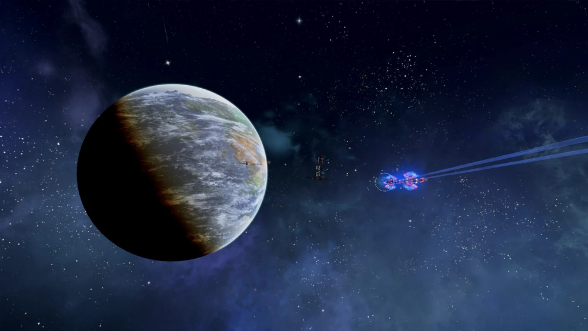
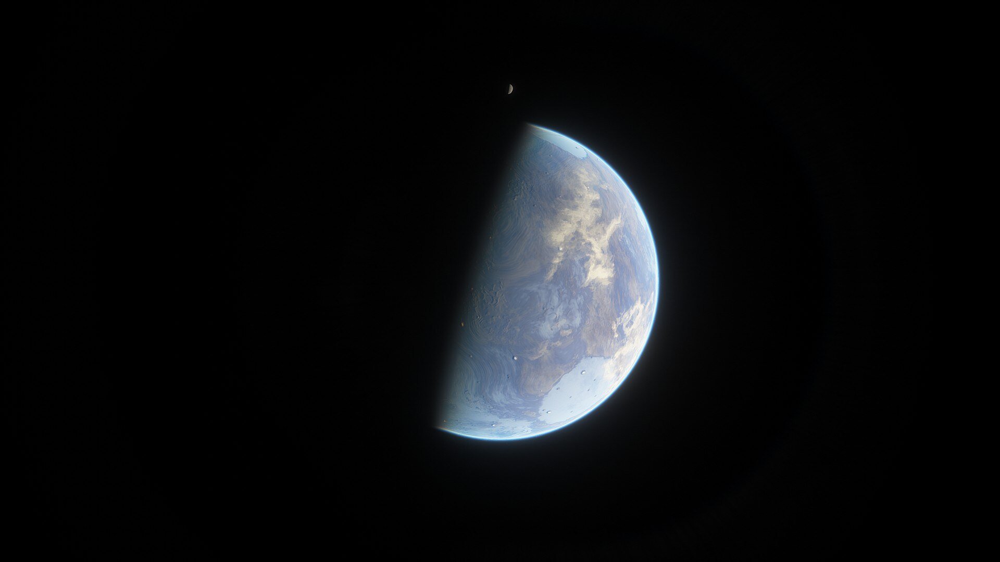
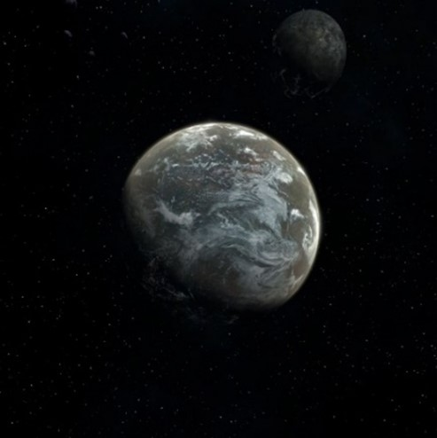

# Argon联邦

## Argon Prime

<figure><figcaption></figcaption></figure>

| 行星参数    | 数值                           |
| ------- | ---------------------------- |
| 自转周期    | 24小时2分2秒                     |
| 半径      | 5961km                       |
| 表面重力加速度 | 
9.16ms^-2

0.94g
 |
| 所在星区    | Argon Prime                  |
| 所属恒星    | Sonra                        |

[Argon Prime](#user-content-fn-1)[^1]是Argon联邦的核心行星，也是联邦政府机构驻地。Argon Prime是Sonra行星系统的第四颗行星，因此原名为Sonra Ⅳ。为了纪念战争英雄Nathan R. Gunne而命名为Argon Prime。

Argon Prime位于一个稳定的椭圆轨道上，拥有一颗卫星Luna，气候与地球非常相似，平均气温为17℃。

美丽的Argonia市位于行星最大的海洋日本海[^2]海边。Argonia既是这颗行星的首府，也是整个Argon联邦的首都。

这颗行星最有趣的一个特点是面积广大的海洋中都是淡水，这是一个困扰了不少地质学家的难题。

## Desolum Ⅳ

<figure><figcaption></figcaption></figure>

| 行星参数    | 数值                           |
| ------- | ---------------------------- |
| 自转周期    | 14小时29分55秒                   |
| 半径      | 4216km                       |
| 表面重力加速度 | 
6.48ms^-2

0.66g
 |
| 所在星区    | -                            |
| 所属恒星    | Glau                         |

Argon联邦的重要行星之一。[Desolum Ⅳ](#user-content-fn-3)[^3]是Glau的第四颗行星，Glau系统中还有一颗气体巨行星，因为某种不明原因，这颗气体巨行星被称为“胡椒军士[^4]”。

虽然Desolum Ⅳ位于Glau的金凤花环[^5]上，但是它却没有任何生命形式存在，也没有可供呼吸的大气。直到Teladi在CE 2730年匆忙改造了这颗行星。这一行动很大程度上促进了CoP接纳Teladi作为自己的成员。

## Ledda

<figure><figcaption></figcaption></figure>

| 行星参数    | 数值                           |
| ------- | ---------------------------- |
| 自转周期    | 31小时9分9秒                     |
| 半径      | 6142km                       |
| 表面重力加速度 | 
9.44ms^-2

0.97g
 |
| 所在星区    | Cloudbase                    |
| 所属恒星    | Wolke B                      |

Ledda是Wolke B的第二颗行星，为了纪念探险家Emily Ledda而命名。她在CE 2419年首次绘制了这颗行星的地图，并且发现了这里已经有原生生物的存在。这些生物从遗传学角度看有些类似Boron王国的生物，但是又有一些区别。

很多人猜测是“协助者”在约200万年前造访了Ledda，这个未知种族在Boron历史上扮演了重要的角色。

今天Ledda是Argon联邦的领地，约400万Argon和60万其他种族在此居住，但这也是Argon联邦最不重要的殖民地之一[^6]。

## Ringo Moon

<figure><figcaption></figcaption></figure>

| 行星参数    | 数值                           |
| ------- | ---------------------------- |
| 自转周期    | 114小时14分43秒                  |
| 半径      | 5559km                       |
| 表面重力加速度 | 
8。54ms^-2

0.87g
 |
| 所在星区    | Ringo Moon                   |
| 所属恒星    | Glau                         |

该星球也常被称为“Ringo's Moon”，它是围绕气体巨行星“胡椒军士”运行的四颗大型卫星之一。虽然理论上这是一颗卫星，但是它的尺寸却接近行星[^7]。

Ringo Moon的表面气温比较凉爽，年平均气温13℃。它绕行“胡椒军士”和Glau的轨道极为复杂，再加上其他三颗大卫星复杂的潮汐作用[^8]，使得Ringo Moon的圆度非常高，表面没有海洋也没有较大的湖泊，这也是它名字的来源。

目前Ringo Moon的人口只有110万Argon和2万其他种族，但是其人口增长潜力非常可观。

\

***

\[1]&#x20;

\[2]&#x20;

[^1]: 本章的比较混搭，优先从X4当中截取，如果没有则从X3当中截取。两者皆无的话从Space Engine当中选择参数与外观描述相近的行星。

[^2]: 原文“Sea of Japan”，与地球上的日本海完全同名。

[^3]: 原文中本节标题写成了“Desolus”，而除标题外所有文本都是“Desolum”，对比之下认定为标题写错。

[^4]: 胡椒军士（Sgt. Pepper）这个名字的来源有可能是披头士的第八章专辑《胡椒军士的孤独之心俱乐部乐队》（Sgt. Pepper's Lonely Hearts Club Band），发行于1976年，滚石唱片将其称为“世界上最伟大的摇滚乐队创造的最伟大的摇滚专辑”。该专辑也被改编成音乐电影和Live。

[^5]: 金凤花环或者金凤花区（Goldilocks Zone）指的是一颗恒星周围可以维持液态水存在的宜居带。位于此区域内的行星被称为“金凤花行星”（Goldilocks Planet）。

[^6]: 问题在于X3中，三个Cloudbase星区就在Argon Prime旁边最多3跳的距离，其中也有核心星区，这里也无法解释为什么原文会加上这么一句话。

[^7]: 原文写的是“在大多数星表中被列为行星”，这句话过于离谱于是修改了一下。行星和卫星的定义从来就不是按照尺寸来的，木卫三比水星还要大，也只能列为卫星，不可能列为行星。

[^8]: 在现实当中，多个大卫星构成的系统会因为轨道共振而形成非常规整的卫星轨道，不会“极为复杂”。很典型的就是木星和土星的卫星群。
