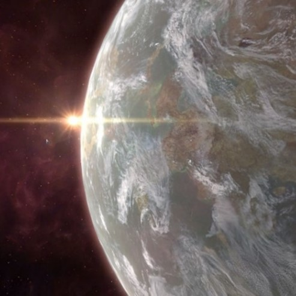
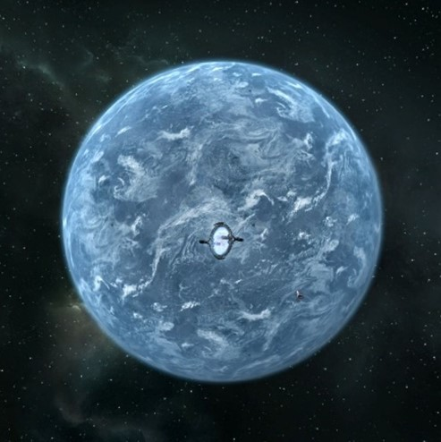
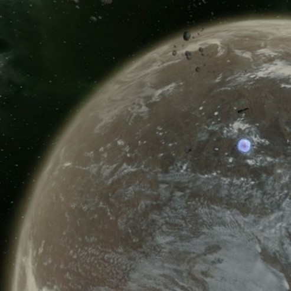

# Boron王国

## Elysium

<figure><figcaption></figcaption></figure>

| 行星参数    | 数值                           |
| ------- | ---------------------------- |
| 自转周期    | 16小时39分9秒                    |
| 半径      | 4821km                       |
| 表面重力加速度 | 
8.41ms^-2

0.76g
 |
| 所在星区    | Mists of Elysium             |
| 所属恒星    | Noreya                       |

Elysium是Noreya行星系统中的第六颗行星。约20亿年前，这颗行星与另外一颗行星大小的天体发生了碰撞，撞击导致了这颗行星出现了逆行[^1]。

Elysium的表面平均气温仅有9℃，本地生长的耐低温植被非常丰富。

Elysium是Boron王国的领地。一般来说，不会有其他种族在此长期居住。在此居住的Boron个体数量未知，但是考虑到其比较有限的水体规模，估计不会超过10亿。

## Jamshala

<figure><figcaption></figcaption></figure>

| 行星参数    | 数值                           |
| ------- | ---------------------------- |
| 自转周期    | 154小时55分27秒                  |
| 半径      | 3001km                       |
| 表面重力加速度 | 
4.61ms^-2

0.47g
 |
| 所在星区    | Depth of Silence             |
| 所属恒星    | Tryan                        |

Jamshala又名Tryan Ⅰ，位于Depth of Silence星区，是Boron王国所属的行星之一。尽管该行星半径很小、自转缓慢，但是它不仅是Boron规模最大的殖民地，也是CoP所有种族中规模最大的殖民地。它的整个表面几乎全部被海洋覆盖，为Boron提供了巨大的栖息地，大约有210亿Boron居住于此，还有1500万其他种族居住在为数不多的、高出海平面的陆地之上。

Jamshala是Boron王国第二国会驻地，这也是Boron王国政府机构中拥有否决权的机构之一。

## Nishala

<figure><figcaption></figcaption></figure>

| 行星参数    | 数值                            |
| ------- | ----------------------------- |
| 自转周期    | 39小时10分18秒                    |
| 半径      | 7171km                        |
| 表面重力加速度 | 
11.02ms^-2

1.13g
 |
| 所在星区    | Kingdom End                   |
| 所属恒星    | Eo                            |

这颗行星又名“Boron Prime”或者Eo Ⅱ，它位于Kingdom End星区，是Boron的母星。

Nishala大气的主要成分是氨，这对于依赖氧气进行呼吸的种族来说是致命的，而为数不多的陆地也几乎全部被充满有毒物质的沼泽覆盖，海洋里同样含有这些有毒物质，但是本地的生物——包括Boron，对此早已习以为常。

在这里的海洋里居住着610亿Boron，这一数字比CoP其他所有种族的个体数量加起来还要多。

## Myadedisha

<figure><figcaption></figcaption></figure>

| 行星参数    | 数值                            |
| ------- | ----------------------------- |
| 自转周期    | 6天52分51秒                      |
| 半径      | 6666km                        |
| 表面重力加速度 | 
11.24ms^-2

1.05g
 |
| 所在星区    | Rolk's Drift                  |
| 所属恒星    | Nash Eo                       |

Boron使用冰小行星轰击这颗行星，直到其表面完全被水覆盖，他们才创造了这样一个海洋世界。Myadedisha是围绕Rolk's Drift星区的恒星Nash Eo运转的第四颗行星。

Myadedisha的四季不甚分明，表面温差比较小，是较为凉爽的12℃。

这颗行星没有本土生物，所有动植物群系都是Boron从母星Nishala上带过来的。这里生活的唯一种族也不出意料都是Boron，常驻个体数量大约为90亿。

[^1]: 行星或者卫星公转方向与自转方向相反的情况称为逆行。太阳系中的海卫一（Triton）就是很典型的逆行卫星。
