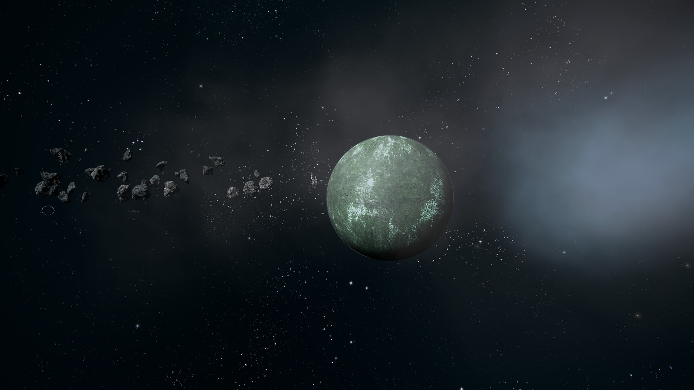
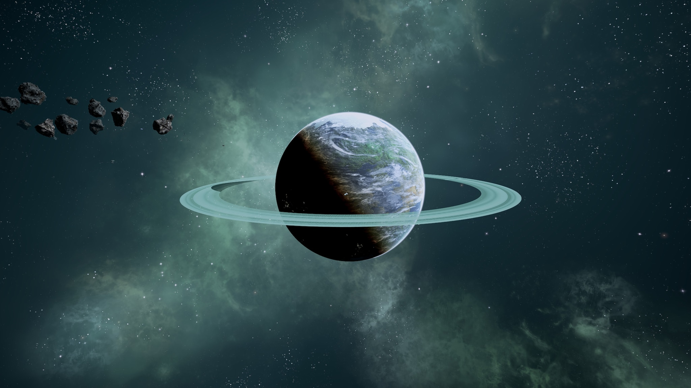

# Hatikvah自由联盟

## Fiji

<figure><figcaption></figcaption></figure>

| 行星参数    | 数值                                               |
| ------- | ------------------------------------------------ |
| 自转周期    | 22小时16分2秒                                        |
| 半径      | 6378km                                           |
| 表面重力加速度 | 
9.8ms^-2

1g
                         |
| 所在星区    | [The Hole / Hewa's Twin](#user-content-fn-1)[^1] |
| 所属恒星    | Ouija                                            |

Fiji是Ouija行星系统中的第4颗行星，位于The Hole星区。Fiji是中立星际联盟Hatikvah自由联盟的行星之一。

Fiji和同属一个行星系统的姊妹行星Hewa被称为“冰火双生子”，这两颗行星的数据几乎完全一致，但是Hewa的地表平均温度只有12℃，比Fiji低得多。

Fiji的地表有75%的面积都是陆地，其中仍然有广大的地区尚未开发，大约2000万各种族居民在此定居，并且人口仍有极大的增长潜力。

## Hewa

<figure><figcaption></figcaption></figure>

| 行星参数    | 数值                       |
| ------- | ------------------------ |
| 自转周期    | 22小时16分2秒                |
| 半径      | 6378km                   |
| 表面重力加速度 | 
9.8ms^-2

1g
 |
| 所在星区    | The Hole / Hewa's Twin   |
| 所属恒星    | Ouija                    |

Hewa是Fiji的姊妹行星，而且是Hatikvah自由联盟的首都行星。

CE 2681年，Argon自由思想家Christiane Hatikvah建立了一个名为“爱”的小镇，作为她实施“全种族和平共存”构想的试验田。50年内，这个小镇就发展成为Hatikvah自由联盟。20年后，该联盟被Argon联邦正式承认。

今天，Hewa是ICSCS总部所在地，ICSCS是一个跨国实体组织，负责涉及到CoP所有种族事务的决策。

Hewa的居民约有12亿人，其中75%是Argon。

[^1]: 在X3当中位于The Hole，但是在X4当中，已经包含了Hewa's Twin这一星区，很显然其中的两颗行星就是这两颗“冰火双生子”。
