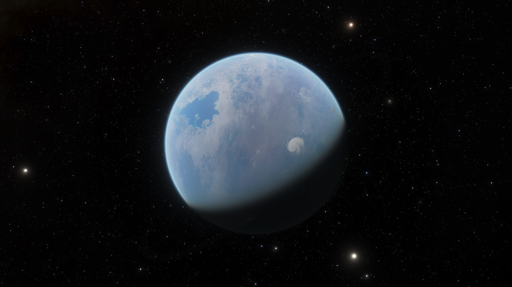

# Paranid神圣帝国/三位一体圣国

## Wirband

<figure><figcaption></figcaption></figure>

| 行星参数    | 数值                            |
| ------- | ----------------------------- |
| 自转周期    | 44小时12分56秒                    |
| 半径      | 12912km                       |
| 表面重力加速度 | 
19.84ms^-2

2.03g
 |
| 所在星区    | Trinity Sanctum               |
| 所属恒星    | Might of Faith                |

Wirband的官方名称为Might of Faith Ⅲ，位于Trinity Sanctum星区。这颗行星是Paranid发现的第一颗在各方面都与Paranid Prime高度相似的行星。

对于其他种族来说，这颗行星几乎一无是处——地表平均温度高达56℃，重力加速度超过2g，几乎没有水，也没有什么值得探索的自然资源。

CE 2372年，休眠中的教皇的陵寝就建在此处。此后，这颗看起来并不起眼的行星便不对任何重生祭司[^1]以下的人开放。

## Paranid Prime

<figure><figcaption></figcaption></figure>

| 行星参数    | 数值                            |
| ------- | ----------------------------- |
| 自转周期    | 68小时19分57秒                    |
| 半径      | 14313km                       |
| 表面重力加速度 | 
21.99ms^-2

2.25g
 |
| 所在星区    | Paranid Prime                 |
| 所属恒星    | Reborn to Life                |

Paranid Prime又名Eighth Eye，他既是Reborn to Life行星系统中第八颗行星的名字，也是它所在星区的名字，同时，这也是Paranid神圣帝国的首都和母星。

Paranid Prime的地表平均气温高达61℃，是整个CoP中最炎热、最干旱但是仍然有人居住的行星，再加上其漫长的日长，使得大规模风暴在其晨昏线上横跨整个行星。几乎整个行星的地表都被橙色的沙子覆盖，几乎所有的山脉也都被严重风化变成了残骸。

大约40亿Paranid居住在该行星地下的地道中，没有任何其他文明曾经出现在这里的迹象。

## Seventh Eye

<figure><figcaption></figcaption></figure>

| 行星参数    | 数值                           |
| ------- | ---------------------------- |
| 自转周期    | 23小时4分2秒                     |
| 半径      | 6330km                       |
| 表面重力加速度 | 
9.73ms^-2

0.99g
 |
| 所在星区    | Paranid Prime                |
| 所属恒星    | Reborn to Life               |

Seventh Eye是Reborn to Life行星系统中的第七颗行星，也是Paranid Prime夜空中最明亮的天体。这颗贫瘠的岩石行星既没有磁场也没有大气层，完全暴露在恒星的辐射风当中。

针对Seventh Eye的“征服行动”发生在Paranid神圣帝国的第一个繁荣期间。Paranid在此期间开始发展航天技术，史称“重返天空”。

今天，这颗行星的巨大钢制模型就是对这个时代的纪念。这个模型悬挂在教皇圣座的正上方。传说，如果这个模型掉下来砸死教皇，Paranid神圣帝国也会随之覆灭。

## Sentuie

<figure><figcaption></figcaption></figure>

| 行星参数    | 数值                           |
| ------- | ---------------------------- |
| 自转周期    | 11小时26分49秒                   |
| 半径      | 10870km                      |
| 表面重力加速度 | 
16.7ms^-2

1.71g
 |
| 所在星区    | Paranid Prime                |
| 所属恒星    | Soul's Well-being            |

CE 2201年，这颗行星被Paranid神圣帝国征服。它又叫Soul's Well-being Ⅴ，这是Paranid在自己的行星系统（Reborn to Life）之外征服的第一颗行星。

Sentuie地表平均气温较为凉爽，为13℃，星球表面较为多样化，有宽阔的海洋，也有高耸的山脉。其亚热带有大片的森林，其中最常见的物种是垂枝树[^2]，垂枝树的木材拥有超高的强度，在CoP市场上有很高的价值。

这颗行星上同样建有一座巨大的教堂，教堂开凿在一个大型山脉的岩层中，数百万Paranid的茧被安放在其中。

[^1]: 原文为“Trice-Born Priest”。成年Paranid拥有随时结茧休眠的能力，从休眠中苏醒被认为是“重生”。

[^2]: 原文“Weeping Tree”。Weeping有形容树木枝条下垂的意思。
