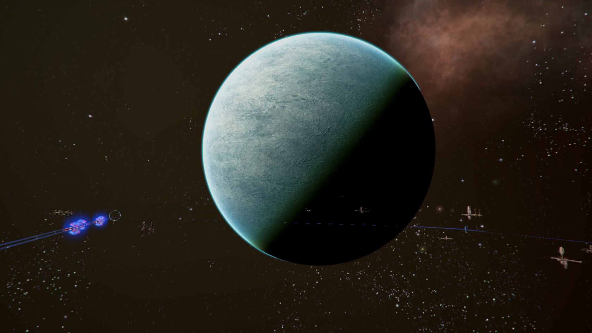

# Paranid神圣帝国/三位一体圣国

## Wirband

<figure><figcaption></figcaption></figure>

| 行星参数    | 数值                            |
| ------- | ----------------------------- |
| 自转周期    | 44小时12分56秒                    |
| 半径      | 12912km                       |
| 表面重力加速度 | 
19.84ms^-2

2.03g
 |
| 所在星区    | Trinity Sanctum               |
| 所属恒星    | Might of Faith                |

Wirband的官方名称为Might of Faith Ⅲ，位于Trinity Sanctum星区。这颗行星是Paranid发现的第一颗在各方面都与Paranid Prime高度相似的行星。

对于其他种族来说，这颗行星几乎一无是处——地表平均温度高达56℃，重力加速度超过2g，几乎没有水，也没有什么值得探索的自然资源。

CE 2372年，休眠中的教皇的陵寝就建在此处。此后，这颗看起来并不起眼的行星便不对任何重生祭司[^1]以下的人开放。

## Paranid Prime

[^1]: 原文为“Trice-Born Priest”。成年Paranid拥有随时结茧休眠的能力，从休眠中苏醒被认为是“重生”。
