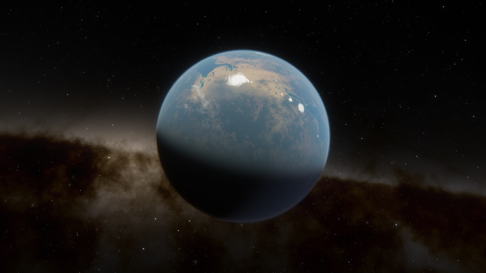
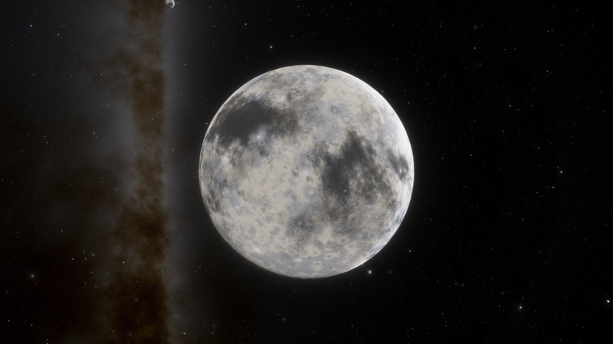

# Solara自由邦

## Aldrin

<figure><figcaption></figcaption></figure>

| 行星参数    | 数值                         |
| ------- | -------------------------- |
| 自转周期    | 23小时31分41秒                 |
| 半径      | 6510km                     |
| 表面重力加速度 | 
10ms^-2

1.02g
 |
| 所在星区    | Aldrin                     |
| 所属恒星    | Solara                     |

为了纪念古代地球太空探索的先驱Buzz Aldrin而命名。Aldrin是Solara行星系统中的第二颗行星，也是星区的名称。其生物圈与地球非常类似，这也是地球早期殖民地包括Argon Prime（Sonra Ⅳ）、Perfect X和Taurus的共同特点，它们也被称为“四颗蓝珍珠[^1]”，Aldrin就是其中之一。

在超过300个地球年前，Aldrin与Argon联邦政府断绝了关系，并且切断了跳跃门[^2]。在这一系列事件中，Anthea Demetres永久政府扮演了重要角色。

随着地球人冲突的升级，Aldrin对外界军事与政治事件的兴趣也在增长，但是他们依然维持了不加入Argon联邦的决定。

CE 2934年，太阳系人类重新与Aldrin建立了联系，Aldrin的跳跃门重新开放。

## Armstrong

<figure><figcaption></figcaption></figure>

| 行星参数    | 数值                           |
| ------- | ---------------------------- |
| 自转周期    | 19小时27分50秒                   |
| 半径      | 4329km                       |
| 表面重力加速度 | 
6.65ms^-2

0.68g
 |
| 所在星区    | Aldrin                       |
| 所属恒星    | Solara                       |

为了纪念古代地球太空探索的先驱Neil Armstrong而命名。Armstrong是Solara行星系统中距离Solara最近的行星。它的轨道不稳定，呈现出一种螺旋性。模拟计算显示，最多在1亿年内，它就将坠落在恒星表面。

Armstrong表面没有居民，也没有大气层，但是它的自然资源极为丰富，尤其是金属资源。在这颗行星上发现了大量的Nividium矿藏。CE 2938年，Teladi公司曾经提出用巨额资金购买在Armstrong整颗行星上采矿的权利，但是遭到了拒绝。

[^1]: 在X3 TC中，Aldrin星区并未发现“蓝珍珠”样子的行星背景。

[^2]: 详情参考[Aldrin冲突](../li-shi-shi-jian/hang-xing-lian-he-hui.md#aldrin-chong-tu)。
