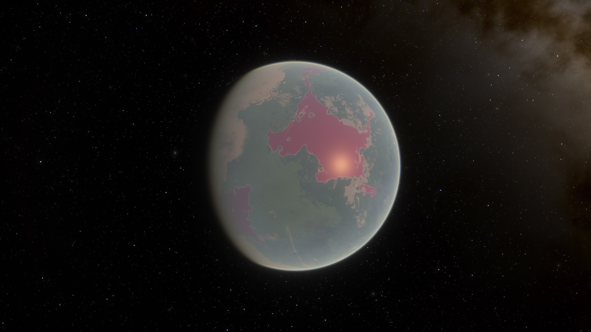
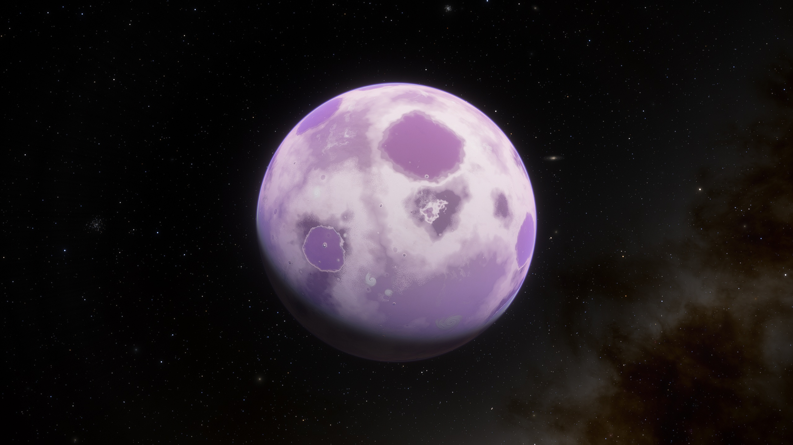
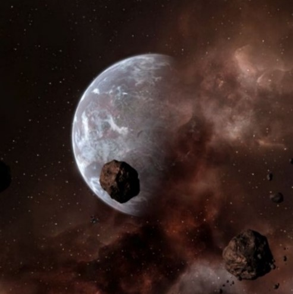

# Split大酋长国

## Nif-Nakh

<figure><figcaption></figcaption></figure>

| 行星参数    | 数值                        |
| ------- | ------------------------- |
| 自转周期    | 21小时22分0秒                 |
| 半径      | 6340km                    |
| 表面重力加速度 | 
9.74ms^-2

1g
 |
| 所在星区    | Patriarch's Keep          |
| 所属恒星    | Noh-tha                   |

Nif-Nakh是Noh-tha行星系统中的第二颗行星，位于Patriarch's Keep星区，有两颗卫星，分别是Woltrar和Rinin。

Nif-Nakh这个名字直译过来的意思是“溃烂伤口”。从轨道上看，这颗行星像是被一个狂怒的捕食者重伤，表面上覆盖着浓密的深绿色丛林，丛林之间是红玻璃一样的海洋。海洋水体呈现这种颜色的原因是其中的微生物。本地生长的植物之间有很多大型昆虫和水生动物。

Nif-Nakh的环境非常严酷，这颗行星并非Split官方认可的殖民地，但是它却是Split大酋长的驻地，他的宫殿就建在这里。大约2000名Split居住于此，没有其他种族在此居住。

## Lho-Ingtar

<figure><figcaption></figcaption></figure>

| 行星参数    | 数值                            |
| ------- | ----------------------------- |
| 自转周期    | -136小时5分54秒[^1]               |
| 半径      | 7740km                        |
| 表面重力加速度 | 
11.89ms^-2

1.22g
 |
| 所在星区    | Tharka's Sun                  |
| 所属恒星    | Tharka-ghan                   |

Lho-Ingtar是Split大酋长国的三颗核心行星之一，正式名称为Tharka-ghan Ⅳ，位于Tharka's Sun星区。表面气温仅有7℃，陆地面积占比18%，这和典型的Split殖民行星的地表环境相去甚远。然而，本地居住的Split仍然有大约30亿。

Lho-Ingtar被认为是Split的文化中心，只有“真正的勇士”方可居住于此，他们在表现出对他人的轻蔑方面显的更节制一些。与大多数Split殖民地不一样，Lho-Ingtar没有完全处于大酋长的治下，而是由一个独立的督察委员会管理着一切，这个委员会的性质更类似Teladi公司，拥有独立的财政权力。这也使得这颗行星变成了Rhonkar大酋长的眼中钉肉中刺，欲除之而后快。其他种族的历史学家则认为督察委员会的存在有助于Split向正面发展。

## Kasum Ⅳ

<figure><figcaption></figcaption></figure>

| 行星参数    | 数值                                                                                                                                                                                                                                                                                             |
| ------- | ---------------------------------------------------------------------------------------------------------------------------------------------------------------------------------------------------------------------------------------------------------------------------------------------- |
| 自转周期    | 15小时55分48秒                                                                                                                                                                                                                                                                                     |
| 半径      | 6210km                                                                                                                                                                                                                                                                                         |
| 表面重力加速度 | 
9.54ms^-2

0.98g
                                                                                                                                                                                                                                                                   |
| 所在星区    | Rhonkar's Cloud                                                                                                                                                                                                                                                                                |
| 所属恒星    | 
Kasum-ghanKasum Ⅳ是恒星Kasum-ghan行星系统中的第四颗行星，位于Rhonkar's Cloud星区。这是一颗类地行星，表面气温14℃。星星上有两块大陆，其中有一块有人居住。这颗行星上有一个覆盖大部地表的超大型海洋。

该行星的经济基础是一种被称为“Jabal”的植物。Jabal的花在CoP的市场上有很高的需求量，但是由于其采摘完全无法机械化，因此价格也居高不下。Kasum Ⅳ也是督察委员会管理下的行星之一。Split贸易联合会雇佣当地的Argon采摘Jabal，贸易联合会也拥有这颗行星向Teladi公司进行贸易的协议。
 |

[^1]: 自转周期为负数说明该行星为逆向自转，即自转与公转方向相反，下文的金星也是同样的情况。
