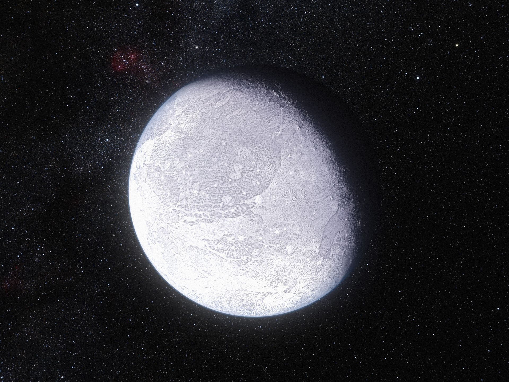
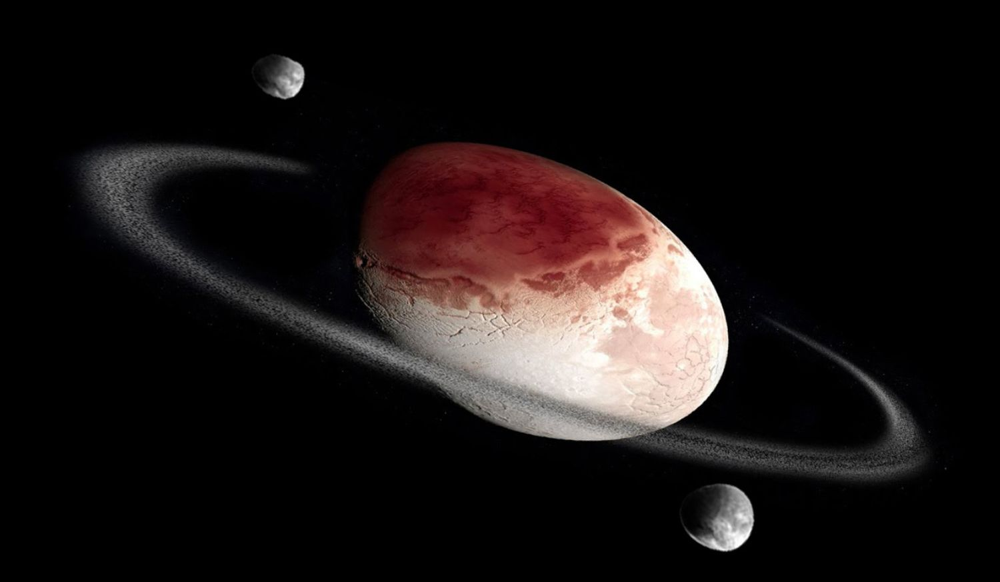
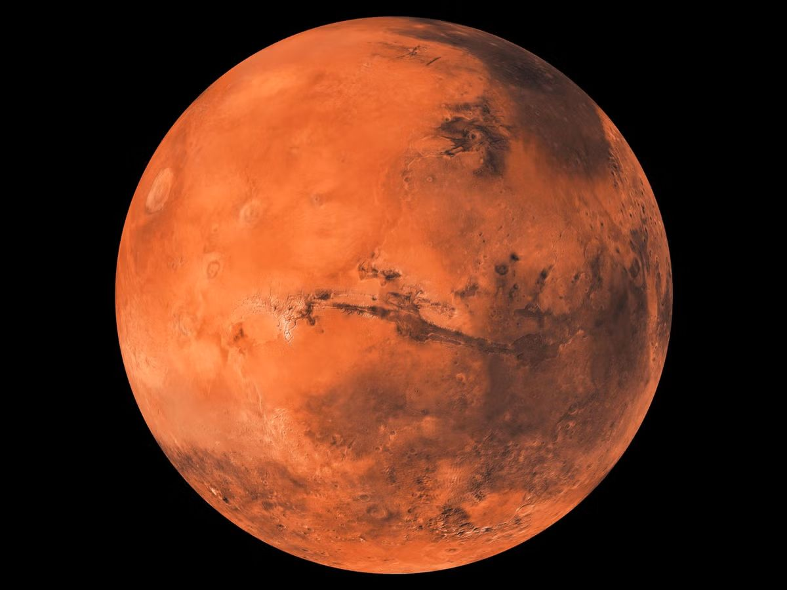
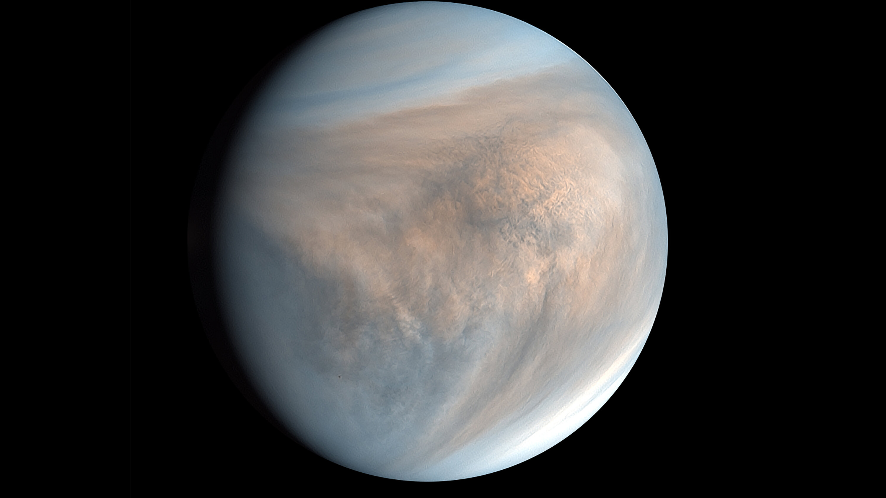

# 太阳系

## 阋神星

<figure><figcaption></figcaption></figure>

| 行星参数    | 数值                           |
| ------- | ---------------------------- |
| 自转周期    | 26小时                         |
| 半径      | 1200km                       |
| 表面重力加速度 | 
0.77ms^-2

0.08g
 |
| 所在星区    | 柯伊伯带[^1]                     |
| 所属恒星    | 太阳                           |

阋神星（Eris）是太阳系[^2]中的一颗柯伊伯带矮行星。这个行星系统中的第三颗行星就是地球，即地球人、Argon和Aldrin居民的母星。

CE 2546年，这颗死气沉沉的行星开始接受改造。110年后，第一轮改造完成，一颗名为“Rabinowitz”的人造太阳被放置在阋神星轨道上以提供额外的光照和热量。阋神星上空800km处覆盖有一层纳米微粒（即所谓的“多功能迷雾”）以防止人造的大气层散逸。

这里的居民数量大约为6万，大多数都居住在人造海洋——北海周围，地球人与阋神星本地居民杂居。联合太空司令部（USC）也在此处设有基地。

## 妊神星

<figure><figcaption></figcaption></figure>

| 行星参数    | 数值             |
| ------- | -------------- |
| 自转周期    | 3小时55分         |
| 半径      | 1100/550km[^3] |
| 表面重力加速度 | N/A[^4]        |
| 所在星区    | 柯伊伯带           |
| 所属恒星    | 太阳             |

妊神星是GEOSS下属行星之一。在CE 23世纪的某个时间，妊神星被用作USC中央基地和第一船坞所在地。

600年间，妊神星已经被改造成了一个军事堡垒，船坞和研究团队被安置在大规模的地下建筑群中，妊神星的椭球体中央被挖出了一个直径4km的洞窟，灌入空气，用于零重力训练。

妊神星作为和阋神星相呼应的军事化行星，约有11.4万军人长期驻扎于此。

## 火星

<figure><figcaption></figcaption></figure>

| 行星参数    | 数值                           |
| ------- | ---------------------------- |
| 自转周期    | 24小时37分22秒                   |
| 半径      | 2296km                       |
| 表面重力加速度 | 
3.96ms^-2

0.36g
 |
| 所在星区    | 火星                           |
| 所属恒星    | 太阳                           |

火星是太阳系的第4颗行星。GEOSS将火星作为核心行星之一。火星的表面平均气温为-55℃，然而，在被称为“水手谷[^5]”深处的宜居区域内，气温可以维持在20℃往上。和阋神星一样，多功能迷雾被用于防止大气在低重力下逃逸，但是和阋神星不同的是，这里的气温并非由人造恒星维持，而是利用了Twelvetowns殖民地的大量工业废热。

Twelvetowns是人类历史上规模最大的城市。它的名字很好地反映了它的历史：最初这里只是水手谷中12个独立的小型研究站，在800年间，它们稳定发展扩张，形成了一个个具备完整居住功能的集镇，最后互相融合成为一个人口超过1.2亿的超大型城市。

## 金星

<figure><figcaption></figcaption></figure>

| 行星参数    | 数值                           |
| ------- | ---------------------------- |
| 自转周期    | -243天4小时26分24秒               |
| 半径      | 6051km                       |
| 表面重力加速度 | 
8.87ms^-2

0.91g
 |
| 所在星区    | 金星                           |
| 所属恒星    | 太阳                           |

金星是太阳系中的第2颗行星。其平均地表温度达到了464℃，地表气压达到92巴[^6]。在已知的类地行星中，它是环境最恶劣的一个。最初的改造计划因为改造者计划的终止而被取消，而用传统方式对金星进行改造被认为太不实际。

CE 2881年，尝试改造金星的计划开始实施。由气球悬吊的一些平台被放到了金星的高层大气中，传统的改造项目将依托这些平台开始进行，整个计划预期耗时2500年。大约4.5万名人类居住在这些漂浮的空中城市当中。

[^1]: 柯伊伯带是位于太阳系海王星轨道外侧、黄道面附近的盘状区域，类似火星和木星之间的小行星带，但是规模大得多，宽度是小行星带的20倍，总质量是20-200倍。柯伊伯带理论上应该是来源于太阳原行星盘外侧的冰碎片，但是这里没有能够形成大行星。此外，阋神星并非经典柯伊伯带天体（QB1天体），而是属于黄道离散天体。

[^2]: 本部分涉及了很多真实存在的天体。经过靠考证，原书数据与真实数据基本一致，如果存在较大出入，会特别说明。

    另外本章的图片优先选择真实照片，其次是NASA等权威网站的艺术图。

[^3]: 此处数据有较大误差。妊神星呈现为一个高离心率的椭球体，凯克望远镜的观测结果是三半轴长度分别为1960km / 1518km / 996km，赫歇尔太空望远镜的观测结果则为平均半径762km±83km，最接近文中所列数据的是斯皮策太空望远镜的观测数据，为平均半径575km。

[^4]: 目前暂时没有关于妊神星的重力加速度数据，而且由于妊神星的扁长几何形状，其表面重力加速度各处也有较大差异。

[^5]: 水手谷（Mariner Valley）是火星上的一条地质断裂带，1972年由水手9号火星探测器发现并因此而得名。水手谷的全长超过4000km，最深处7km，最宽处超过200km。是火星上乃至整个太阳系内已知最大的地质断裂带。很显然，自然状态下的火星表面不可能存在气温始终高于20℃的区域，很有可能这种温度是下文提到的工业废热的结果。

[^6]: 1巴（bar）=100kPa，与一个大气压很接近，1atm≈1.01325bar。
