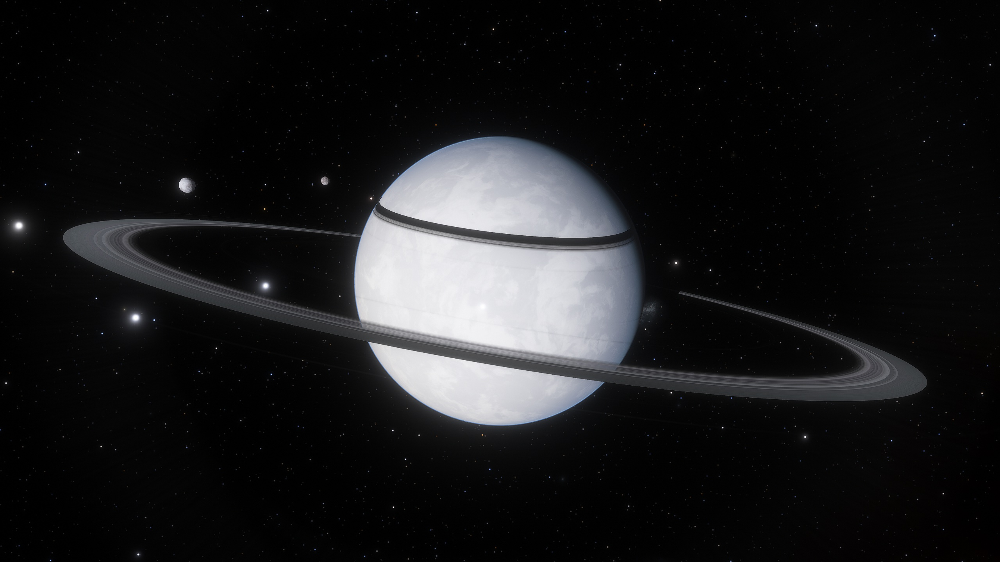

# Teladi公司/Ianamus Zura

## Ianamus Zura

<figure><figcaption></figcaption></figure>

| 行星参数    | 数值                           |
| ------- | ---------------------------- |
| 自转周期    | 26小时4分39秒                    |
| 半径      | 5817km                       |
| 表面重力加速度 | 
8.94ms^-2

0.91g
 |
| 所在星区    | Ianamus Zura                 |
| 所属恒星    | Ianamus Zura                 |

Ianamus Zura既是行星系统中的恒星的名字，也是所在星区的名字，也是这颗行星的名字，它是行星系统中的第九颗。Ianamus Zura是Teladi的母星。在800年前，即大约CE 2146年的一次跳跃门重置当中，Teladi殖民者和它失去了联系。

合适的气候使得这颗行星上出现了多样化的动植物群系，它们生活在沼泽和温暖的浅海之中，这种环境被认为是Ianamus Zura的标志，这里的居民也非常爱护这样的环境。

这颗行星的重要标志之一是它的极光。这里的极光规模非常大，有时甚至可以横亘整颗行星，这是由于系统中的恒星吹出的恒星风中带有大量的带电粒子。

大约20亿Teladi居住在Ianamus Zura，此外还有大约1400万其他种族的居民。

## Nividereos

<figure><figcaption></figcaption></figure>

| 行星参数    | 数值                          |
| ------- | --------------------------- |
| 自转周期    | 7小时44分8秒                    |
| 半径      | 5710km                      |
| 表面重力加速度 | 
9.77ms^-2

0.9g
 |
| 所在星区    | Company Pride               |
| 所属恒星    | Company Pride               |

Nividereos的平均地表温度低到了-110℃，Nividereos是Company Pride行星系统中的第11颗行星。这是已知的有人居住的行星当中最冷的一颗之一。所有居民都不得不居住于地下，Teladi殖民者在很久之前就开始在这里挖掘了复杂的地道。

Nividereos拥有一些Teladi孵化场和金融学校。这些孵化场和Platinum Ball上的那些精英孵化场并不构成竞争关系，而是为经济较为紧张的Teladi家庭孵化后代。如果其他种族的少年儿童愿意进入Teladi的金融圈子，他们也可以加入这里的金融学校学习。

## Platinum Ball

<figure><figcaption></figcaption></figure>

| 行星参数    | 数值                            |
| ------- | ----------------------------- |
| 自转周期    | 19小时3分1秒                      |
| 半径      | 6878km                        |
| 表面重力加速度 | 
10.57ms^-2

1.08g
 |
| 所在星区    | Company Pride                 |
| 所属恒星    | Company Pride                 |

Platinum Ball是Company Pride行星系统中的第7颗行星，它被认为是Teladi公司的核心所在[^1]，拥有3颗卫星。

Platinum Ball的气候温暖，近乎于亚热带气候，地表平均气温17℃，尽管80%的表面被水体覆盖，其上仍然有一系列群岛和两块比较大的大陆，分别名为Ebelon和Homaseos。Homaseos大陆是很多Argon的度假胜地，也是这颗行星的孵化场的所在地。

有传言说Platinum Ball是被另一个未知的种族改造的，但是Teladi公众对此并不感兴趣，对此也未展开任何调查。同样，在两极地区被怀疑为大气发生器的巨型构造也无人去调查。

## Compound Interest

<figure><figcaption></figcaption></figure>

| 行星参数    | 数值                           |
| ------- | ---------------------------- |
| 自转周期    | 16小时8分9秒                     |
| 半径      | 4517km                       |
| 表面重力加速度 | 
6.94ms^-2

0.71g
 |
| 所在星区    | Maximum Net Yield            |
| 所属恒星    | Nemeredas                    |

这颗矮行星是Maximum Net Yield星区中Nemeredas行星系统的第48颗行星。

其表面温度低至-120℃，没有永久居民，但是这颗行星却被认为是Teladi公司当中重要程度仅次于Platinum Ball的行星，有重兵保护。

原因很简单：这是Teladi公司的永久金库，公司的所有财产都保存在这里。

[^1]: 奇怪的是在X3当中，Company Pride被划分为边缘星区。
