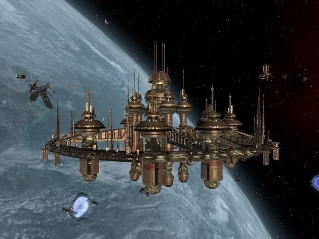

# BRENNAN, Kyle William

<figure><figcaption></figcaption></figure>

[**BRENNAN, Kyle William**](#user-content-fn-1)[^1]（CE 2873 年 1 月 19 日，地球 新西兰 惠灵顿 - ），前 USC 军官，后来成为 CoP 的一位企业家。

## 生平

### 早期生活

Kyle Brennan 是协议夫妻[^2] William Rohan 和 Lynette Brennan 的第二个孩子。他有两个姐妹 Sherie Lynette（生于 CE 2870 年）和 Chris Lynette（生于 CE 2879 年）。在波澜不惊的童年之后，14 岁的 Kyle Brennan 在火星 Twelvetowns 度假时结识了几名 USC 飞行员，并和他们成了朋友。Kyle Brennan 为这些飞行员的故事深深着迷，于是决定自己也去当一名飞行员。这是他的毕生目标，并且最终也实现了这一目标。

### 加入 ATF

完成训练后，Kyle Brennan 加入了 ATF，ATF 的任务是防止 AGI 技术的滥用。在获得了少校军衔后，Kyle Brennan 获得了自主制定和执行任务的权限。

在一次任务中，他认识了 Elena Kho。后者的聪慧和自信立即给他留下了深刻的印象。

### 行星际巡逻任务

CE 2903 年，Kyle Brennan 指挥了一次针对非法 AGI 研究的打击行动。此次行动成功之后，Kyle Brennan 转到了 USC，并且成为了 USC 巡洋舰指挥官。CE 2904 年，两年没见的 Elena Kho 也来到了他的舰上服役。

### 试飞任务

CE 2911 年，Kyle Brennan 主动请缨从巡逻任务调往 SPAARF 项目。SPAARF 项目的目的是开发一款实用型的跳跃引擎。他的申请很快就通过了。然而，尽管身披骄人的飞行记录，Kyle Brennan 仍然只是首次载人跳跃飞行的替补飞行员。首选飞行员是 **Yihako Edell**。然而阴差阳错，Edell 在试飞前的第四天病倒了。于是 Brennan 受命接替他执行试飞任务。

令人惊讶的是试飞失败了。一个跳跃隧道意外地连接到了一个未知的跳跃门，并很快坍缩，将 Kyle Brennan 和他驾驶的 USC X 困在了一个有外星人居住的陌生区域。这里还有很久之前与地球失去联系的人类殖民者的后裔。

### 到达 CoP

刚开始，CoP 的各方势力都在寻找 Kyle Brennan。但是他最终还是逃到了 Argon Prime 的一个安全港内。不久之后，Elena Kho 前来与他会合。Elena Kho 的飞船“Getsu Fune”在 Argon Prime 上迫降时遭到了严重的破坏。在 Elena Kho 和 Goner 们的见证下，Kyle Brennan 终于让人们相信他确实是来自那颗早已被 Argon 忘记的母星——地球。

USC X 的脉冲推进技术极为先进，Kyle Brennan 随后指挥了一场针对 Xenon 进攻的反击行动（[第二次 Xenon 冲突](../li-shi-shi-jian/yu-di-qiu-de-lian-xi.md#di-er-ci-xenon-chong-tu)）。这为他赢得了“战争英雄”的赞誉。

### 个人生活

在意识到自己短期内无法回归地球后，Kyle Brennan 选择在 CoP 定居。他和 Goner 学者 Ninu Gardna 相爱并签署了婚姻协议。他们育有一子，即 [Julian Brennan](gardna-julian.md)。然而由于两人巨大的背景差异，这段婚姻只续约了一次就宣告终止。

在 Argon 法律框架下，Ninu Gardna 主张自己单独抚养儿子的权利。尽管最初有所反对，Kyle Brennan 最终还是接受了她的决定。

### TerraCorp

<figure><figcaption>
位于 Home of Light 的 TerraCorp 总部（摄于 NT 764 年）
</figcaption></figure>

在有生之年重返地球的愿望在 Kyle Brennan 心中愈加强烈。TerraCorp——一家完全在 Argon 联邦法律框架下组建的股份有限公司就是这一愿望的具体体现。这家公司的首要目标便是复原 USC X 和 Getsu Fune 上损坏的跳跃引擎。

十年间，跳跃引擎修复的进展不大，但是在更广泛的通用技术领域，TerraCorp 倒是多有涉猎。

在此期间，Elena Kho 离开了 TerraCorp。

### 晚年生活

在天琴座ο战斗期间，曾经的战争英雄再次上阵。他冒着生命危险在Kha'ak的攻击下保卫CoP。随后他被Kha'ak劫持，并被强迫驾驶Kha'ak的M0巨型战舰[^3]。获救之后很长一段时间，他都处于昏迷状态，不过最后他还是康复了。

### 回归地球

虽然曾经无比渴望回归故乡，但是当地球与跳跃门网络连接，故乡真正就在眼前之时，Brennan 却踟躇起来。最终，在使命感以及好奇心的驱动下，Kyle Brennan 还是回到了故乡——地球，并致力于改善 GEOSS 与 Argon 联邦政府之间的外交关系。但是在地球人冲突期间，双方的外交关系还是急转直下。

第二次改造者战争期间，Kyle Brennan 失踪，至今下落不明。

[^1]: 本部分标题与 Intro 按照正式的姓名写法，Family Name 以全大写写在最前面，和 First Name、Middle Name 之间以逗号分隔。按照欧美姓名的一般书写习惯，这个名字可以写作 Kyle William Brennan。

[^2]: 合理推测，当时的地球和 Argon 联邦的婚姻制度是一种协议制度，协议有一定期限，协议到期后双方可以续约，也可以终止协议。

[^3]: 此处仍然采信官方Wiki与X4时间线的说法。
