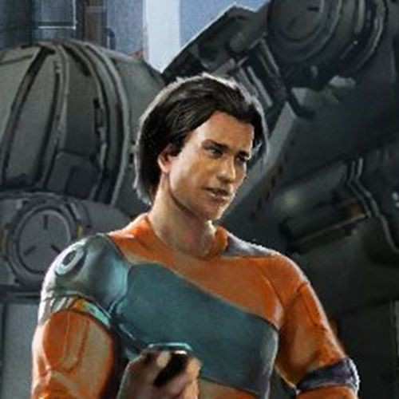

# 大谷廉

<figure><figcaption></figcaption></figure>

**大谷 廉**（**OTANI, Ren**）（？，Albion - ），自由职业者、冒险家、传奇飞船Albion Pride（现名为Albion Skunk）已知的最后一任船主。

## 生平

### 早年生活

大谷廉在跳跃门关闭后的若干年出生于Plutarch社区空间站B，他的父亲是PMC数据分析员大谷オラン，母亲为大谷雯雅。童年时期，他结识了若干好友，其中有几个Teladi，这也让大谷廉成为数量极少的可以熟练掌握Teladi语言的Argon人。

由于父亲供职于PMC，他在社区内的生活相对比较优渥，但是在他12岁时，他的父母双双去世，留下了一笔不薄的遗产。但是大谷廉并不愿意像他的父亲那样从事压力巨大的工作，他决定离开PMC，追寻更狂野的生活。

此后，大谷廉自学了很多知识，特别是航天、机械工程、天体物理和程序设计方面。

### 自由职业

离开PMC后，大谷廉开始经商。他首先开始倒卖服装和个人装备，17岁时，他购买了第一艘属于自己的飞船——一架名为“Vigilant Harrier”的小型截击机。大谷廉通常会在Albion星区巨大的垃圾场里独自一人闲逛，花费大量时间搜罗有价值的物品，然后运回空间站出售。作为一名Albion自由职业者，PMC对他的能力和活动颇感兴趣，也会向他提出工作要约。但是他唯一接受过的一个任务是给PMC的货船提供护航，期间，大谷廉和主权辛迪加（Sovereign Syndicates）的飞船发生交火，但是时候PMC拒绝就他的飞船受到的损伤作出补偿，这导致了大谷廉和PMC管理层交恶。

### 发现Albion Skunk

大谷廉重操旧业，继续在Albion的垃圾场里寻宝。他已经差不多存够了购买一条大型货船的钱。但是在Albion一处偏远的垃圾场内，他竟然发现了一条完整的被丢弃的飞船，ID显示为“Albion Skunk”，这显然是被恶意修改的，事实上，这条飞船是由著名Boron工程师Bala Gi设计、Jonferco建造的传奇飞船Albion Pride。被发现时，这条飞船几乎无法使用，经过大谷廉几天的修复工作，飞船的舰载计算机和引擎都成功启动了。但是，由于舰上的日志已被删除，这条传奇飞船是如何流落至此的已经不得而知。

有鉴于Albion Skunk的卓越性能和她巨大的历史价值，大谷廉决定继续修复这条飞船。在HOA工程师Yisha Tarren的帮助下，Albion Skunk得到了充分的修复。
