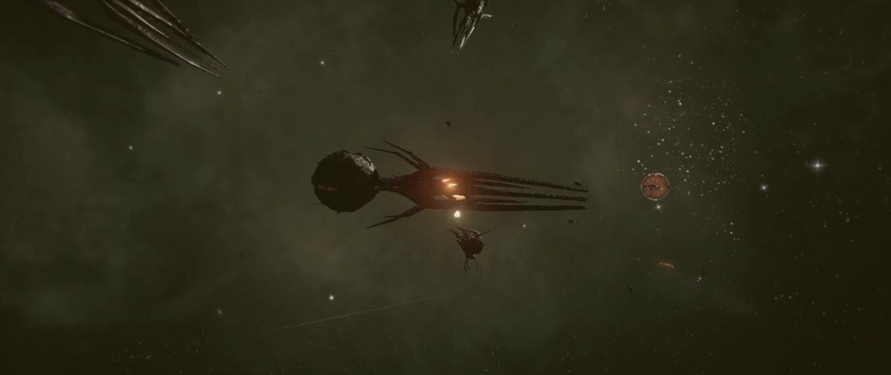

# GARDNA, Julian

<figure><figcaption></figcaption></figure>

**GARDNA, Julian**或者**BRENNAN, Julian**（NT 747年117日，Argon Prime - ），前冒险家，现为Argon联邦探员。

## 生平

### 幼年和青年时期

Julian Gardna出生于NT 747年117日，是[Kyle Brennan](brennan-kyle-william.md)和Ninu Gardna的儿子，他有一位大他8岁的兄长。

个人背景的差异导致了他的父母最终分开，当时Julian Gardna只有2岁。Ninu Gardna回到Goner神庙之后，带着幼子开始了跨越整个CoP的壮游，以寻找一个安身之所。

NT 758年，一连串的意外让他们不得不在Turpentine空间站寻求庇护，而这里就是犯罪集团Yaki的总部。尽管Ninu Gardna试图加以管束，但是Julian Gardna还是很快就和Yaki的坏小子们混到了一起。

### 第一次犯罪

Julian Gardna和他的朋友Bret Serra成立了一个犯罪团伙，开始时他们只是进行一些零星的网络犯罪活动。后来，他们就开始盗窃飞船，甚至在尚未成年的时候，Julian Gardna就已经背上了好几次武装抢劫的罪名。

### 被捕与出狱

在一次偷盗飞船的时候，Julian Gardna被空间站警卫逮捕，随后移交给了Argon联邦司法机关，Julian Gardna被判入狱。

在服刑期间，Argon联邦海军将领、海军旗舰Argon One舰长Ban Danna开始好奇Julian的身世，他很快就查明Julian是自己的好友Kyle Brennan和Ninu Gardna的儿子。Ban Danna与他们已经很久没有联系了，他决定给Julian Gardna一个洗刷罪行的机会，Julian抓住了这个机会。

### 服役

NT 763年到NT 765年，Julian Gardna参与了针对Kha'ak的大规模军事行动以及一些针对Yaki的行动。但是由于母亲Ninu Gardna仍然在Yaki的势力范围内，他从未接近Turpentine空间站，并且更多的时候以父亲的姓自称为Julian Brennan。

<figure><figcaption>
Julian Gardna、Saya Kho和Bret Serra一同参与了对Kha'ak的大规模军事行动，此次行动中Bret牺牲
</figcaption></figure>
