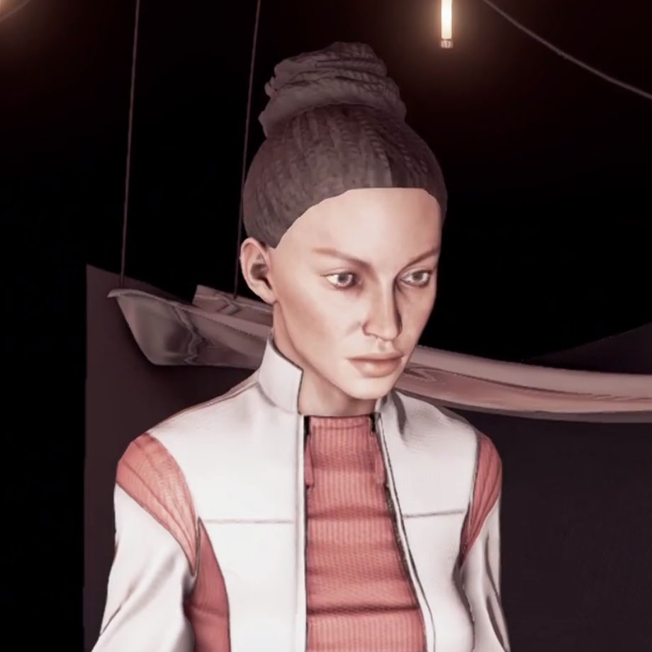

# SHEPPARD, Mitsuno

<figure><figcaption></figcaption></figure>

**SHEPPARD, Mitsuno**（**薛帕德·三津野**）（CE 2042，Sohnen计算设施 - ），是由Sohnen创造的人造意识体。

三津野是Sohnen在计算设施当中最早创造的人造意识体之一。但是她对“现实宇宙”抱有极大的怀疑，认为被植入的虚拟人生才是“真实”的。因此，她很早就开始了“逃离设施”的计划并付诸行动。

由于对执行MD交给的任务非常不配合，她也很早便被MD和同事们“抛弃”了，宿舍的门牌也被取了下来并上了锁，这反而给了她更大的行动空间。

三津野在计算设施的一个暗处死角建立了一间秘密工坊，私自拉出线路和神经连接器，试图从中找到逃离计算设施的方法。这一行动得到了Harper Donel和另外一位Split人造意识体的配合，最终她成功打开了通往计算设施“管理中心”的大门，并在这里见到了建立并控制计算设施的Sohnen个体。

<figure><figcaption>
三津野持枪与Sohnen对峙
</figcaption></figure>

三津野强烈要求Sohnen将自己“送回原本的生活”，甚至持枪与Sohnen对峙。出于这一人造意识体对计算任务极度不配合的现状，Sohnen只能切断了她与合成身体的联系，将三津野送回到了“数据梦境”当中，让她继续作为普通生物度过一生。

三津野在“数据梦境”中的后续情况无人得知。

三津野向所有的人造意识体揭开了计算设施的真实情况与目的，仍然得到了很多人造意识体的尊重和纪念。包括对计算任务非常热衷的[陈香织](chen-xiang-zhi.md)。陈香织后续留在现实宇宙继续生活，为了纪念三津野，她将奎塔航者势力占据的星区命名为“Mitsuno's Remembrance”。

> 迷失于黑暗，发现于光明。
