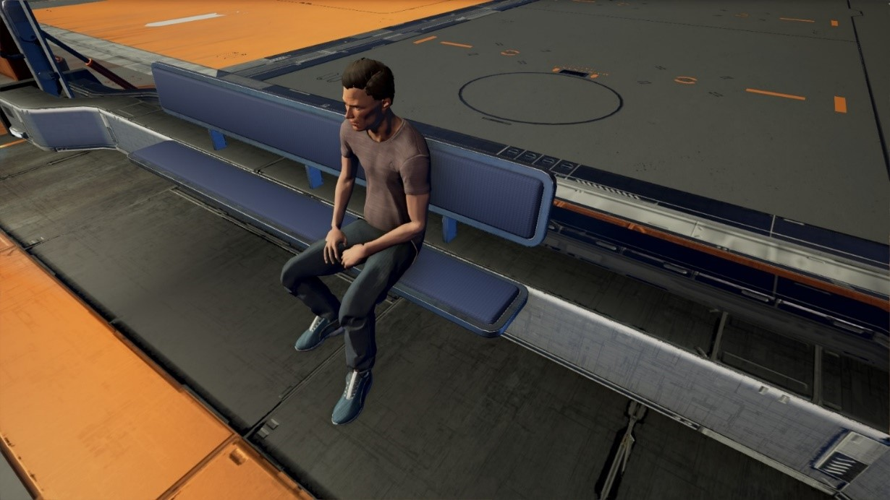

# Argon

<figure><figcaption>
一名男性Argon，摄于NT 825年，于Argon Prime联邦造船厂停机坪
</figcaption></figure>

## 分类

智人（Homo Sapiens）。

Argon是智人属中演化的一个物种。传统意义上，智人特指地球人类。

## 命名

有一种说法称“Argon”的名字来自第18号元素氩。不管是发音还是拼写都完全一致。但是实际上并非如此。“Argon”的名称来自于一颗名为Argon Prime的行星，再往前追溯则是Nathan Ridley Gunne，这是[第一次改造者战争](../li-shi-shi-jian/di-yi-ci-gai-zao-zhe-zhan-zheng.md)期间解救地球的战争英雄。“Argon”是“R. Gunne”的变音，在数个世纪的语音变化后演变成了今天的“Argon”这个名字。

Argon以单一种族形式存在，所有Argon人都是智人属，其起源与地球人相同，都来自地球上的非洲。任何人类——不论其家园为何，只要成为Argon联邦永久居民，都会被称为“Argon”。

## 历史与起源

Argon的历史与地球有非常紧密的关联。

随着跳跃门网络首次被发现，太阳系外的行星逐渐变成人类的殖民地。这些人类最初的殖民地很快就开始发展起来。其中最大的一个殖民地位于半人马α所属的行星Taurus上。CE 2147年，Taurus在第一次改造者战争中遭到灭顶之灾，10万居民之中只有2万人幸存。战争带来的放射性污染迫使幸存者永久放弃了Taurus。他们也无法回到地球，只能被迫去寻找一个新的家园。[CE 2148年，殖民者们来到了完全没有受到战争摧残的Sonra Ⅳ](#user-content-fn-1)[^1]，简称“4号”，并在此定居下来。随着移民项目的完成，Sonra Ⅳ被正式命名为“Argon”。随着Argon联邦的成立，这颗行星又更名为“Argon Prime”以和其他行星区分开来。

## 生物与解剖结构

Argon是双足、人科、人属物种，从遗传角度上说，他们与地球人共有一个祖先。Argon与地球分离的时间相对较短，只有千余年，这还不足以分化出一个新的物种出来。

Argon人和地球人之间几乎没有生理意义上的差别。但是Argon人仍然有一些典型的外观特征，包括黑色的直发、皮肤颜色略深、身高略高。当前Argon人的平均寿命约为110地球年，地球人的平均寿命与之相当，这主要是由于医学的高度发达、食物质量的提升以及文化层面上对自身健康的更多的关注。

## 语言、文化与宗教

Argon联邦的官方语言是一种简化的日语，称为“新古日语”（Neo Jap-pidgin）。这种语言也广泛应用于联邦中与非人类成员的贸易沟通。此外，多数Argon人都会说英语，其中也有很多以英语为母语的人。

Argon社会崇尚自由，社会秩序建立在强大的社会道德基础上。他们与新的种族、新的生活方式接触甚多，因此对不同的世界观和哲学观点抱有高度宽容的态度，但是，他们也随时准备为捍卫自己的生活方式战斗至最后一刻。

Argon联邦的科技水平高度发达，所以宗教在Argon联邦几乎销声匿迹也就不足为奇。大约半数Argon人宣布自己有“某种精神信仰”，但并不是某个具体的神。其余则大多数宣称自己是无神论者。

## 政府机构

Argon联邦采取集中制、议会民主制。政府元首是总理，负责在4 NT年[^2]的任期内制定联邦的政治纲领。总理的任期结束后不可谋求连任。

## 人口分布

Argon总人口约120亿，分布在39颗类地行星上。其中28颗直属于Argon联邦，其他11个则隶属于Solara自由邦（Aldrin）和Hatikvah自由联盟。CoP的其他种族也常常将地球人误认为Argon人。

Argon联邦的重要行星包括：

* Agrippina
* Argon Prime（Sonra Ⅳ）
* Demeter
* Desolum Ⅳ
* Ledda
* Montalaar
* Perfect X
* Sandwell[^3]
* Shipfall

[^1]: 此处原文有问题。原文在这里的表述是殖民者在Taurus被摧毁后才发现了Sonra Ⅳ，但是实际上，前文表明Sonra Ⅳ和Taurus都是人类开发的第一批太阳系外殖民地，此处采信后一种说法并在此处修正。

[^2]: 原文备注NT纪年4年约合5.5地球年。但是另一种说法则是NT纪年当中的年（Jazura）相当于0.53个地球年，照此计算，4 NT年应当约为2.12 CE年。不过本篇百科当中年份长度的Bug过于逆天、深入骨髓，细想就出不来了。就当它是普普通通的1年就行。

[^3]: Sandwell位于Antigone Memorial星区。在跳跃门关闭的防火带时期Antigone Memorial与周边星区独立为Antigone共和国，脱离了Argon联邦。但是Antigone共和国与Argon联邦有非常紧密的联系，Argon联邦的数据服务器就位于Sandwell。
