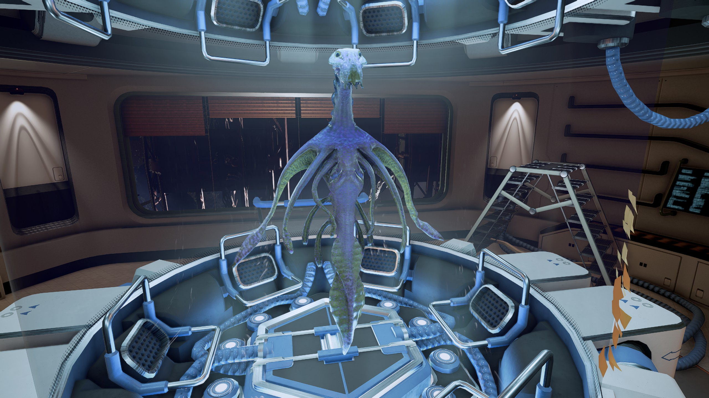

# Boron

<figure><figcaption>
Boron科学家Boso Ta，摄于NT 825年，于某未知势力的大型空间站当中
</figcaption></figure>

## 分类

Nishala乌贼（[Sepioteuthis Nishalaensis](#user-content-fn-1)[^1]）。

是一种由类似头足类动物演化而来的水生物种。

## 命名

“Boron”是第5号元素硼的名称。但是和Argon一样，Boron这个名字和硼也没有任何关系。它来自新古日语，词源已经无法考证。一些学者认为，这个词的起源是对这个种族爱好和平的天性的无礼嘲讽。

Boron自己则使用一种咔哒声和信息素表达的称呼来称呼自己，这种称呼对于其他种族来说完全无法理解和复述。

## 历史与起源

Boron起源于一颗海洋行星，这颗行星的正式名称为!Ni-!Sha-!La，简写为Nishala。它一直是Boron王国的行政中心和最重要的行星。

Boron天性爱好和平。他们在开发航天技术之前，这个种族的所有个体与族群之间都没有爆发过任何冲突。因此，Boron的军事技术也一直是一片空白。大约5万地球年前，Boron遇到了一群造访Nishala的外星种族，他们自称“协助者”。协助者拥有高于Boron的文明水平，但是他们具体是谁至今无法确认，但是可以肯定的是并非Ancients或者Sohnen。协助者在Nishala上逗留了几代人的时间，随后离开。协助者没有留下任何踪迹，只有遥远的传说和遗留下来的先进技术和超前的知识。协助者的帮助让Boron一跃成为标准的太空文明，然而另一方面，这也让Nishala过早地被其他更具侵略性的种族发现——比如Split。迫于自卫的压力，这个爱好和平的种族第一次开始研发武器技术，随后转入进攻态势。

## 生物与解剖结构

Boron有六肢，其中四个较大、较强壮。除了这六个主要肢体以外，还有数量不等的更小的肢体，称为“游肢”。成年Boron可以将肢体中的一些骨骼互锁，来抓握、控制一些物体。他们的游泳方式与地球上的章鱼有些类似：从腮吸水，然后从身体后方的一个管道喷出。

Boron有三种性别：雄性、雌性和“Larr”。尽管Larr在Boron的繁殖行为中并非必需，但是在交配中Larr仍然很受欢迎。

Boron的个体寿命大约为35地球年。

## 语言、文化与宗教

Boron的语言有两种主要元素，其中一种是基于声音的，由一系列咔哒声组成，可以在水中传播很长的距离，有些类似于地球上的鲸歌。另一种则是信息素。Boron可以释放出一团信息素，其中有信息编码，可以被其他的Boron感知并解读。这种本能的行为被称为“品尝”。

信息素可以传递的信息非常多，Boron可以分泌多达911种信息素，其间的组合方式几乎是无穷无尽的。这种信息素团可以在水中留存数年之久，在这几年当中，其中包含的信息素都可以被完整读取。

Boron有两种文化派别。生活在Nishala深海的Boron更喜欢一种传统的生活方式，以三个个体为一个单位，称为“Triad”。而生活在浅海的Boron则更倾向于接受更现代、更高科技的生活方式。这两个派别和平共存，并且都认为对方的存在丰富了自己的生活。

Boron缺乏任何有组织的宗教，也不信仰全能的创造者或神明。但是他们很多都认为自己死后可以在Ancients的存在之云中继续生活。

## 政府机构

根据官方说法，Boron是国王/女王统治下的君主制政体。但是Boron王国仍然有议会制民主制选举制度和相应的政府机构。由于Boron传统意义上比较信任Larr，因此国会和政府的成员普遍都是Larr。在此基础上的所谓“Larr民主[^2]”不仅被允许存在，而且广受国民欢迎。

## 人口分布

在CoP体系内，Boron个体数量为460亿，是个体数量最多的种族。然而，其中有75%的Boron都生活在Nishala深海，其余生活在Boron殖民地的海洋或者其他种族所属星球的海洋之中。最典型的例子是Argon联邦所属行星Perfect X，这颗行星上有一个名为“Terrific”的海洋，约有20亿Boron个体在其中生活。

Boron王国的重要行星包括：

* Nishala
* Jamshala
* Mayadedisha
* Mashamasia Ⅱ

[^1]: “Sepioteuthis”是拉丁语“乌贼”的意思。而“Nishalaensis”是以Boron母星Nishala为字根，加上拉丁语的语言风格生造出来的一个字。

[^2]: 原文为“Larrocracy”。
