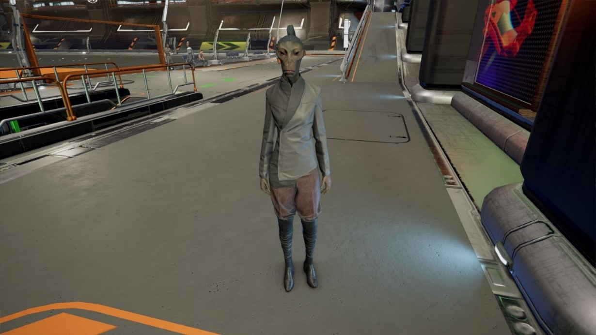

# Split

<figure><figcaption>
一名女性Split，摄于NT 825年，于Family Zyarth高科技产品工厂。
</figcaption></figure>

## 分类

智人（Homo Sapiens）。

Split是一种类人种族，在CoP中以性情暴躁而著称。

## 命名

“Split”这个名字的来源已经不可考，但是可以确定的是它并非来自Split自己的语言，其初始含义可能更接近贸易用语中的一个相同的词。

## 历史与起源

根据传说，Split的母星是Hodie。然而，在经历了全球规模的核战争后，Hodie已经变得不再适合居住。于是Split放弃了自己的家园，开始在一些贫瘠的行星上殖民，然后继续着自相残杀。然而，Hodie是否存在这个问题，在Split内部也有很大的争议。

传说中第一位Split大酋长Ghus t'Gllt的传说可靠性同样存疑。传说中正是这位领袖将陷入分裂、互相疏远仇视的Split人名统一在一起，并且他还发现了女性Split作为“抑制者”的能力。这些事件都是确凿无疑的，但是是否是由Ghus t'Gllt操办或者在他的命令下执行，在数百年后已经无从考证。

## 生物与解剖结构

Split在外观上与人类非常相似，主要的区别是手脚都是六趾。男性Split更加矮胖、强壮一些，平均身高180cm，女性则一般会高出几厘米，并且显得如苦行僧一般瘦削。

除了外观上的些许区别，Split在遗传学上则与人类完全不同。Split的染色体并非由DNA构成，因此Split不可能与人类杂交。

男性Split的平均寿命大约为50个地球年，女性则超过80个地球年。这种差异主要原因是男性Split过于激进、危险的生活方式，他们很少注意自己的健康状况。

## 语言、文化与宗教

Split语言包含一系列音元，加上广泛的手语支持，可以表达非常丰富的情绪，不过其中绝大多数都是恐吓和侮辱。其他种族也可以学习Split的语言，但是由于手上没有6根手指，因此人类无法学习Split的全部手语——除了一些只需要5根手指的手势。

Split实行一种部落酋长制社会制度，但是和其他采用同样制度的文明相比，Split的这种社会制度显然缺乏其应有的稳定性——虽然他们正在努力实现这一目标。在历史上，传说在大酋长Ghus t'Gllt的统治之下，Split有过一段繁荣期，但是现在的Split已经再度四分五裂，回到了传统的混乱状态。

Split没有宗教的概念。大多数Split都认为宗教只是一种过时的迷信行为。他们自己也是如此放弃宗教的。在Split进入太空时代之前，“天空中的怪兽”是根植于每个Split心中的恐怖传说，但是现在这种传说已经不再为人所知了。

## 政府机构

Split大酋长是超越所有氏族酋长的独裁者。

Split大酋长并非通过选举产生的，也并非通过任命方式上台的国家和政府官员，而是通过武装斗争抢到的，这个头衔更像是一个战利品。因此，Split大酋长必须时刻武力捍卫自己的权柄。Split大酋长平均在位时间为3年，每一个新的大酋长都是踩着前任大酋长的尸体登上权力宝座的。

## 人口分布

Split在CoP中的个体数量约为20亿，分别居住在9颗行星和若干个空间站内。
