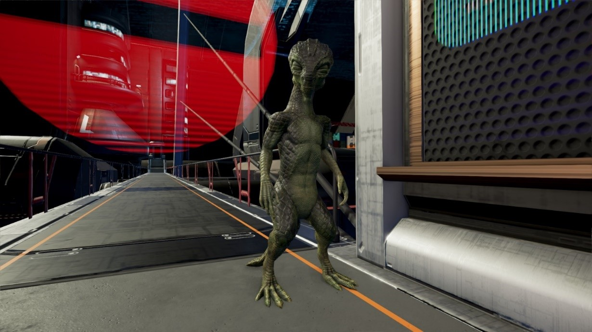

# Teladi

<figure><figcaption>
一名Teladi，摄于NT 825年，于财政部防御平台。
</figcaption></figure>

## 分类

[秃鹫（Vultur Inflatius）](#user-content-fn-1)[^1]。

Teladi是一种由类似于蜥蜴的生物进化而来的智慧种族，也是CoP的创始种族[^2]之一。

## 命名

“Teladi”的词源是“Thechalachi”，这个词源于所谓的“蛋语”，这是Teladi在孵化期间互相交流的一种语言，大约有100多个单词，“Thechalachi[^3]”就是其中之一。

## 历史与起源

Teladi的母星是Ianamus Zura。这颗行星上的沼泽和沿海湿地为Teladi的祖先提供了安全的庇护所和足够的资源。在他们进入太空时代后不久，他们就发现了Ancients的跳跃门网络。Teladi立即对这个网络展开了探索，并且建立了数个殖民地。不幸的是，由于跳跃门网络的重构，部分殖民地和Ianamus Zura失去了联系。这些殖民者从未忘记“梦中的家园”，数百个地球年后，他们才找到了回乡之路。

在与Ianamus Zura失联期间，Teladi殖民者们发现她们产下的卵只能孵化出女性后代。尽管遗传学研究在不断深入，但是这种状况却在一直持续。因此，在与母星失联期间，所有新诞生的Teladi个体都是她们母亲的克隆体。

## 生物与解剖结构

Teladi是一种类似蜥蜴的生物，与地球上的蜥蜴有一定的相似性，但是Teladi的染色体并非基于DNA。

Teladi周身覆盖厚重的鳞片，鳞片呈六边形，有各种不同的色彩，但是其中最常见的是绿色，这种绿色的鳞片被称为“绿鳞”（Scale Plate Green）。成年Teladi对这种色调有一种特殊的喜好，因此在Teladi的世界中，这种绿色很常见。

Teladi平均身高150cm，有两条上肢、两条下肢，四肢各有5个趾，趾间有蹼，因此Teladi天生非常擅长游泳。刚孵化出的Teladi眼睛是浅黄色的，随着年龄增长逐渐变成深红色。他们的眼睛有可见的角膜、瞬膜和第三眼睑[^4]。Teladi几乎所有重要器官都不止一个，如胃有两个、心脏有三个，这使得Teladi拥有极强的复元能力，经受了很严重的身体创伤后仍然能够生存。

Teladi的寿命是有限的。尽管理论上Teladi可以想活多久就活多久，但是大多数情况下，Teladi都是自己不想继续活下去而选择绝食而死。Teladi的平均寿命约为250地球年，最高寿的Teladi已有约400岁。

## 语言、文化与宗教

Ianamus Zura上的Teladi和CoP中的Teladi社会文化明显不同。前者崇尚一种积极向上、多元开放的生活方式，在他们的生活中，哲学和艺术占据了很大的一部分。而后者则完全不可同日而语。这种区别主要是CoP当中的Teladi缺乏“家庭”这层社会关系，因为CoP中的Teladi全是女性，无法组建正常的家庭。

## 政府机构

Ianamus Zura采用议会制民主制，而CoP的Teladi则采用一种类似于公司的组织管理体系：它由CEO（首席执行官）作为最高领导人，负责制定公司的总体策略，并且向“董事会”负责。

## 人口分布

Ianamus Zura的人口信息不明。CoP中的Teladi个体数量大约有160亿，分布在超过11颗行星和大量的空间设施当中。

Teladi最重要的三颗行星分别是：

* Ianamus Zura
* Platinum Ball
* Compound Interest

[^1]: 虽然从各方面说Teladi都更像是蜥蜴（Lacerta）。但是此处原文将Teladi也归为类似秃鹫。

[^2]: 从时间线上看，CoP成立时还没有Teladi，但是Teladi为CoP贡献了Credit货币系统，因此位列五大流氓之一。

[^3]: 原文此处写的是“Thechelechi”，与前面的拼法不同，此处将其统一为“Thechalachi”，其发音和“Teladi”更相近一些，故而采信这种拼法。

[^4]: 在地球的生物当中，第三眼睑和瞬膜是一个东西，常见于无尾两栖类、爬行类和鸟类，以及部分软骨鱼类。瞬膜是一种半透明的眼睑。哺乳动物的瞬膜多数退化。
